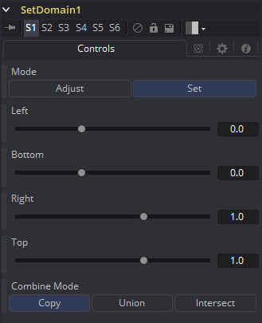
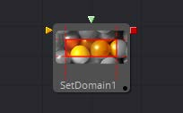
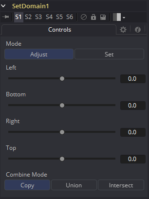

### Set Domain [DoD]

Set Domain用于调整或设置图像的活跃区域，或者换言之，图像被认为拥有有效数据的区域。

它不会改变图像的物理尺寸。任何在DoD之外的东西都不会被下游工具处理，来达到加速渲染计算密集型工具的效果。

本工具提供了一个绝对模式，用于手动设置Domain of Definition（定义域），以及一个相对模式，用于调整现存的Domain of Definition。

#### Controls/Set Mode 控件/设置模式

##### Left 左

定义DoD的左边界。该滑块的高值将左边界向右移动，排除掉左边距中更多的数据。

1表示图像的右边界，0表示左边界。滑块默认为0（左边界）。

##### Bottom 底

定义DoD的底边界。此滑块上较高的值会将底边界向顶移动，排除掉底边距中更多的数据。

1表示图像的顶边界，0表示底边界。滑块默认为0（底边界）。

##### Right 右

定义DoD的右边界。此滑块上较高的值会将右边界向左移动，排除掉右边距中更多的数据。

1表示图像的左边界，0表示右边界。滑块默认为0（右边界）。

##### Top 顶

定义DoD的顶边界。此滑块上较高的值会将顶边界向底移动，排除掉顶边距中更多的数据。

1表示图像的底边界，0表示顶边界。滑块默认为0（顶边界）。

#### External Inputs 外部输入

- **SetDomain.Input：**[橙色，必需的]该输入必须连接至产生2D图像输出的工具。
- **SetDomain.Foreground：**[绿色，可选的]该输入接受一个2D图像作为它的输入。当连接了前景输入时，Set Domain工具将会把Background输入的定义域替换成前景的DoD。

Set模式默认为可见图像的整个范围。

#### Controls/Adjust Mode 控件/调整模式

在Adjust模式中，基本上相同的运算的操作都和Set模式是一样的。所有的滑块都默认为0，标记它们各自的整个图像范围。正值会缩小DoD而负值会扩张DoD来包含更多的数据。