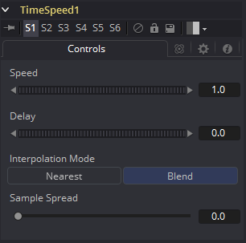

### Time Speed [TSp] 时间速度

Time Speed 允许图像序列加速、减速、反转或延迟。图像插值提供了平滑、高质量的结果。Time Speed应该用于静态的时间改变或向场景中引入延迟。要向时间应用动画，例如时间加速度或减速度，使用Time Stretcher代替。

当在Flow模式中运算时，需要Optical Flow数据。

本工具不会直接生成光流。你必须手动使用Optical Flow工具或从磁盘中加载正向/反向法线通道在上游创建它。

Time Speed不会插值辅助通道，反而会销毁它们。实际上，Vector/BackVector通道在计算后也会被消耗并销毁。

如果你想要为重新调整时间后的场景生成光流向量，请在Time Speed之后添加OpticalFlow。

#### Controls 控件

##### Speed 速度

该控件用于以持续的图像序列的百分比调整时间。负值将会反转图像需序列。200%的Speed表示2.0的值，100%是1.0，50%是0.5，而10%是0.1。

Speed控件不能添加动画。

##### Delay 延迟

使用该控件来使持续的序列延迟指定帧数。负值会将时间向前偏移，而正值会向后。

##### Interpolation Between Frames 帧间插值

当选中后，当前帧的前后帧会插值来创建新的帧。这通常提供了更平滑且清楚的结果。当清除后，不会使用插值。

##### Sample Spread 采样分布

该滑块控制当前帧的采样帧的强度。值为0.5会使前一帧的50%和后一帧的50%和当前帧的0%混合在一起。