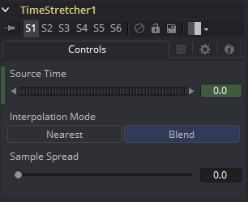

### Time Stretcher [TSt]

Time Stretcher工具与Time Speed工具类似，但是它允许在效果过程中片段的时间添加动画。它提供了包括平滑在内的完整的样条控制。作为结果，Time Stretcher可以用于添加动画至200，再变回原先的速度，暂停仪表，然后向前播放（类似VCR倒带）。

当在Flow模式中运算时，需要Optical Flow数据。

本工具不会直接生成光流。你必须手动使用Optical Flow工具或从磁盘中加载正向/反向法线通道在上游创建它。

Time Speed不会插值辅助通道，反而会销毁它们。实际上，Vector/BackVector通道在计算后也会被消耗并销毁。

如果你想要为重新调整时间后的场景生成光流向量，请在Time Speed之后添加OpticalFlow。

#### Controls 控件

##### Source Time 源时间

该控件指定了从原始序列的那一帧开始采样。

当Time Stetcher工具添加到流程中后，Source Time 控件就已经包含了一个从单个关键帧设置为0.0的Bezier样条。关键帧的位置取决于工具添加到流程中的当前时间。

（Source Time样条也许不是立即可见的，要一直到Source Time的上下文菜单选择Edit或从样条窗口的上下文菜单显示所有样条之后。）

##### Interpolation Between Frames 帧间插值

当选中后，当前帧的前后帧会插值来创建新的帧。这通常提供了更平滑且清楚的结果。当清除后，不会使用插值。

##### Sample Spread 采样分布

该滑块控制当前帧的采样帧的强度。值为0.5会使前一帧的50%和后一帧的50%以及当前帧的0%混合在一起。值为0.25会使前一帧的25%和后一帧的25%以及当前帧的50%混合在一起。只在极特殊的情况下才会将该控件设置为0.25。

#### Example 示例

确保当前时间是项目中受影响片段的第一帧或最后一帧。添加Time Stretcher添加到流程中。这会在当前帧的Source Time样条上创建一个点。Source Time在整个Global Range内会被设置为零。

在项目期间要显示的那一帧上，将Source Time的值设置为要从原始源显示的帧编号。

要将100帧的序列缩短为25帧，遵循以下步骤：

- 更改Current Time为0。
- 更改Source Time控件为0.0。
- 前进至帧24。
- 更改Source Time为99。
- 选中样条结果为线性。
- Fusion将会通过插值将100帧渲染成25帧。
- 持续最后一帧30帧，然后以正常速度回访片段。继续以上的示例并遵循以下的步骤。
- 前进至帧129。
- 右键单击Source Time 控件并在菜单中选择Set Key。
- 前进至帧229（129+100）。
- 设置Source Time为0.0。