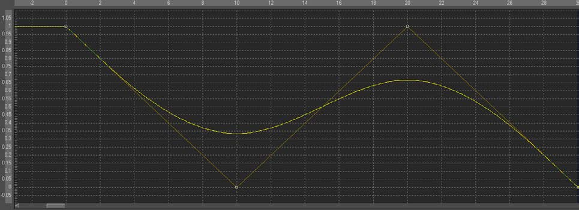

### B-Spline B样条

B Spline使Fusion中的一种动画修改器，一般被用于一些数值类值而不是点类值。它默认在你右键单击一个数值控件并选择Animate时应用。

它也可以通过右键单击数值控件并选择*Modify with > B-Spline*应用。

#### Usage 用法

作为一个动画样条，该修改器没有实际上的Controls选项卡。但是，它的效果和影响可以在Spline Editor（样条编辑器）中看见。注意尽管第二个关键帧的值时0，但是结果样条的值还是为0.33，这是因为B样条独有的平滑的权重算法。

权重可以通过左键单击选择关键帧然后按住W和左键并向左移动鼠标来降低张力或向右移动增加张力。这也可以同时用于多个选中的关键帧。

