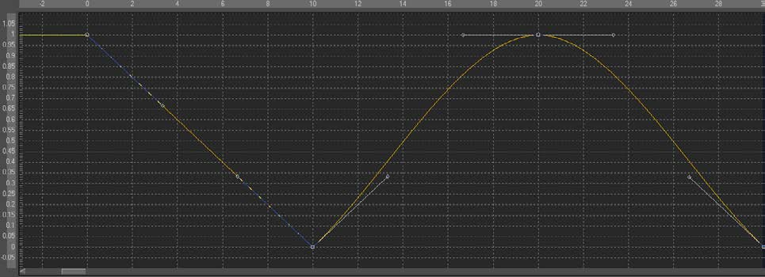

### Bezier Spline 贝塞尔样条

Bezier Spline使Fusion中的一种动画修改器，一般被用于一些数值的值而不是点的值。它默认在你右键单击一个数值控件并选择Animate时应用。

它也可以通过右键单击数值控件并选择*Modify with > Bezier Spline*应用。

#### Usage 用法

作为一个动画样条，该修改器没有实际上的Controls选项卡。但是，它的效果和影响可以在Spline Editor（样条编辑器）中看见。Bezier Spline通过手柄的方法提供了对每个点的平滑度的独立控制。平滑度可以通过多种方法来应用。

- 要使关键点变得平滑，选中它们并按Shift-S。手柄可以用来进一步修改入和出的行为。
- 要是关键点变得线性，选中它们并按Shift-L。这些操作也可以通过上下文菜单来表现。
- 选中关键帧，右键单击选择Smooth（平滑）或Linear（线性）。该菜单也允许用户应用使用Savitzky-Golay滤镜的平滑。选中关键帧，右键单击选择*Smooth Points > Dialog...*。

#### Ease In/Out Can Also Be Modified by Using the Control Slider 缓入/出也可以通过使用控件滑块来修改

选中你想要修改的关键帧，右键单击并在上下文菜单中选择*Ease In/Out...*。然后使用滑块来单独在数值上控制缓入/出。

