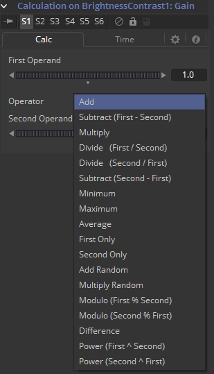
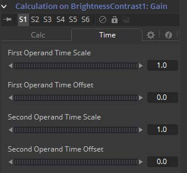

### Calculation 计算

Calculation被用于创建值控件之间的间接连接。一个计算可以用两个运算子的数学表达式来表示每个运算子可以连接至另一个控件或由用户手动设定。

另外，Calculation控件可以通过内建的Time Offsets和Time Scale控件来访问非当前时间时的已连接控件的值。

一个运算最普遍的运用是当两个控件需要互相连接，但是一个控件的值输出的范围和域对于另一个控件来说并不合适。

> **注意：**Expression实质上是Calculation更灵活的一个版本，但有一点例外。对于Calculation来说，操纵提供算子的时机要比Expression来说简单的多。

#### Calc Tab 计算选项卡

##### First and Second Operand 第一个第二运算子

这些滑块用于连接到该合成中其他工具中publish过或添加过动画的控件，或手动将其设置为计算需要的值。

##### Operator 运算符

从该菜单中选择数学运算符来确定如何结合两个运算子。点击向下的箭头会打开拥有如下选项的菜单：

- Add 加
- Subtract 减（`First - Second`）
- Multiply 乘
- Divide 除（`First / Second`）
- Divide 除（`Second / First`）
- Subtract 减（`Second - First`）
- Minimum 较小值
- Maximum 较大值
- Average 平均值
- First Only 仅第一项
- Second Only 仅第二项
- Add Random 加随机
- Multiply Random 乘随机
- Modulo 模除（`First % Second`）
- Modulo 模除（`Second % First`）
- Difference 差
- Power 幂（`First ^ Second`）
- Power 幂（`Second ^ First`）

#### Time Tab 时间选项卡

##### First and Second Operand Time Scale 第一和第二运算子时间缩放

这些控件使得用于读取Calc选项卡中指定的Operand的值的帧可以被缩放。值为1会在合成在x帧时返回帧x时运算子的值。例如，如果第一运算子的值设置为帧0至10时值从1变化至10，那么缩放为0.5会使计算在帧10时返回5的值（实际上就是时动画变慢了一倍来满足计算的目的）。

##### First Operand and Second Operand Time Offset 第一和第二运算子时间偏移

这些滑块返回Time Offset指定位置的Operand的值。值为10会返回运算子10帧之后的值，而-10会返回运算子10帧之前的值。见下方的实际示例。

#### Example 示例

下述示例使用Calculation来文字应用与大小成反比的模糊。

1. 创建一个新的合成，将Global Start和Render Start设置为1。将Global End和Render End设置为100。
2. 向合成中添加Text+工具。
3. 在Styled Text中输出一些文本。
4. 确保当前帧为0。
5. 在第0帧将Text+工具的Size参数设置为值0.06。
6. 右键单击Size滑块并通过设置关键帧来向该控件添加动画。
7. 前进到第100帧并将Size控件的值设置为0.50。
8. 在Text+工具后添加Blur工具。将Blur的输入连接至Text+的输出。
9. 在查看器中查看Blur工具。
10. 我们想要模糊在强度减弱的同时文本变大。该控件不能直接连接在一起，因为Text Size控件的值会变大而不是变小。
11. 右键单击Blur Size并从上下文菜单中选择*Modify With > Calculation*，选择Blur工具时，新一组控件会出现在Modifier选项卡中。
12. 切换至Modifier选项卡（F11）。
13. 右键单击First Operand 滑块，从上下文菜单中选择*Connect To > Text 1 > Size*。尽管这种连接不是非常实用。Blur Size控件的最大值只有0.5，这对于模糊来说时非常不起眼的。
14. 将Operator下拉菜单设定为Multiply。
15. 将Second Operand滑块设置为100。
16. 切换到修改器的Time选项卡并将First Operand Time Scale设置为-1.0。一般来说，第一运算子会获取与当前时间相同帧处所连接控件的值。所以在第10帧时，第一运算子会被设置为Text Size在第10帧中相同的值。但是将值设置为-1的话，合成每往后一帧而值会读取更前的一帧。
17. 然而，这也就意味这Calculation会在合成第10帧时读取第-10帧处的Text Size。为了矫正这个，将First Operand Time Offset滑块设置为100。
18. 返回至工具控件区域的Tools选项卡（F9），按下播放（空格）并观察Blur Size的值是如何与Text Size的值相关联的。