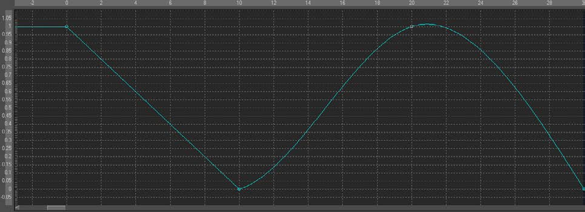

### Cubic Spline 立方样条

Cubic Spline是Fusion中的一种动画修改器，一般被用于一些数值类值而不是点类值。它默认在你右键单击一个数值控件并选择Animate时应用。

它也可以通过右键单击数值控件并选择*Modify with > Cubic Spline*应用。

#### Usage 用法

作为一个动画样条，该修改器没有实际上的Controls选项卡。但是，它的效果和影响可以在Spline Editor（样条编辑器）中看见。