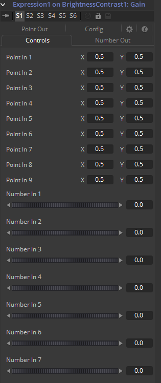

### Expression 表达式

向控件中添加Expression修改器可以使得基于任意数量的控件（基于位置或基于值）来控制和操纵位置或值控件。与功能更有限的Calculation或Offset修改器相比，这个修改器提供了卓越的灵活性，但它无法访问当前时间以外其他帧中的值。

表达Expression最多接受九个值输入和九个位置输入，这些输入用作用户定义的数学表达式的一部分以输出值。

要将表达式添加到控件，右键单击该控件，然后从上下文菜单中选择*Modify With > Expression*。表达式返回的值的类型完全取决于它修改控件的类型。

当与值控件（如滑块）一起使用时，将核算Number Out选项卡中的Expression来创建结果。当用于修改位置控件（例如工具的中心）时，Point Out选项卡将控制结果。

Modifiers视图包含Expression修改器的控件。它的控件描述如下。

#### Controls 控件



该选项卡提供了9个数值控件和9个点控件。数值控件的值在表达式中被引用为`n1`至`n9`。每个点控件的X坐标被引用为`p1x`至`p9x`，而Y坐标是`p1y`至`p9y`。

这些值可以由用户手动设置、连接至其他参数、添加动画或是连接至其他Expression或Calculation。

#### Number Out Tab 数值输出选项卡


这会启用一个用于输入的数学算式，它可以访问Number In和Point In选项卡中的值并输出一个用于修改应用该表达式处控件的值。该字段使用的语法见下。

#### Point Out Tab 点输出选项卡


该选项卡中的每个文本框都可以包含一个数学算式，它可以访问Number In和Point In选项卡中的值并输出一个用于修改应用该表达式处控件的值。上方文本框控件中的表达式用于计算X轴值而下方文本框用于计算Y轴控件。该字段使用的语法见下。

#### Config Tab 配置选项卡


一个好的表达式应该可以被重用的。所以为每个输入取一个更具描述性的名称并隐藏那些没有用到的数据就非常有帮助了。Expression修改器的Config选项卡就是用于自定义9个点和数值输入的可见性与名字的。

##### Random Seed 随机种子

Random Seed控件用于为`rand()`函数设置种子。`rand(x, y)`函数生成一个介于X和Y之间的随机值，每一帧都产生一个新值。只要该Random Seed滑块的值相同，在x帧处生成的值总是相同的。调整该种子滑块为新值来使在该帧获得不同的值。

##### Show Number or Point X 显示数值或点X

18个这样的复选框控件，每个对应了9个数值控件或9个点控件。启用该复选框来在Controls选项卡中显示Number X或Point X的控件。

##### Name for Number or Point X 数值或点X的名称

18个这样的复选框控件，每个对应了9个数值控件或9个点控件。向该编辑控件中为输入键入一个新的名称来为Controls选项卡中的标签分配一个新的名称。

#### **Expression Syntax Formulas 表达式语法公式**

算式作为表达式一部分输入到Number Out或Point Out选项卡中。

它们可以由下列名称与函数组成：

| 名称                             | 描述                                   |
| -------------------------------- | -------------------------------------- |
| `n1..n9`                         | Number Input 1..9的值                  |
| `p1x..p9x`                       | 位置控件1..9的X                        |
| `p1y..p9y`                       | 位置控件1..9的Y                        |
| `time`                           | 当前时间（帧数字）。                   |
| `pi`                             | pi的值                                 |
| `e`                              | e的值                                  |
| `log(x)`                         | 10为底`x`的对数                        |
| `ln(x)`                          | `x`的自然对数（e为底）                 |
| `sin(x)`                         | `x`的正弦（`x`为度数）                 |
| `cos(x)`                         | `x`的余弦（x为度数）                   |
| `tan(x)`                         | `x`的正切（x为度数）                   |
| `asin(x)`                        | `x`的反正弦，以度数为单位              |
| `acos(x)`                        | `x`的反余弦，以度数为单位              |
| `atan(x)`                        | `x`的反正切，以度数为单位              |
| `atan2(x, y)`                    | `x, y`的反正切，以度数为单位           |
| `abs(x)`                         | `x`的绝对值                            |
| `int(x)`                         | `x`的整数（整部）值                    |
| `frac(x)`                        | `x`的小数值                            |
| `sqrt(x)`                        | `x`的平方根                            |
| `rand(x, y)`                     | `x`和`y`之间的随机值                   |
| `rands(x, y, s)`                 | `x`和`y`之间的随机值，基于种子s        |
| `min(x, y)`                      | `x`和`y`之间的最小值（低值）           |
| `max(x, y)`                      | `x`和`y`之间的最大值（高值）           |
| `dist(x1, y1, x2, y2)`           | 点`x1, y1`和`x2, y2`之间的距离         |
| `dist3d(x1, y1, z1, x2, y2, z3)` | 点`x1, y1, z1`和`x2, y2, z2`之间的距离 |
| `noise(x)`                       | 基于`x`的缓慢变化的Perlin噪声          |
| `noise2(x, y)`                   | 基于`x`和`y`缓慢变化的Perlin噪声       |
| `noise3(x, y, z)`                | 基于`x`、`y`和`z`缓慢变化的Perlin噪声  |
| `if(c, x, y)`                    | 若`c`为0返回`x`，否则`y`               |

#### **Expression Syntax Operators 表达式语法运算符**

运算符用于核算语句。它们与函数相结合来表现Number Out和Point Out选项卡中的逻辑和数学计算。

| 运算符 | 描述                                                    |
| ------ | ------------------------------------------------------- |
| `!x`   | 若x=0则为1.0，否则为0.0                                 |
| `-x`   | (0.0-x)                                                 |
| `+x`   | (0.0+x)，即实际上什么都没做                             |
| `x^y`  | x的y次幂                                                |
| `x*y`  | x乘以y                                                  |
| `x/y`  | x除以y                                                  |
| `x%y`  | x模除以y，即x除以y的余数                                |
| `x+y`  | x加上y                                                  |
| `x-y`  | x减去y                                                  |
| `x<y`  | 若x小于y则为1.0，否则为0.0                              |
| `x>y`  | 若x大于y则为1.0，否则为0.0                              |
| `x<=y` | 若小于等于y则为1.0，否则为0.0                           |
| `x>=y` | 若x大于等于y则为1.0，否则为0.0                          |
| `x=y`  | 若x恰等于y则为1.0，否则为0.0                            |
| `x==y` | 若x恰等于y则为1.0，否则为0.0， 与上面完全相同           |
| `x<>y` | 若x不等于y则为1.0，否则为0.0                            |
| `x!=y` | 若x不等于y则为1.0，否则为0.0，与上面完全相同            |
| `x&y`  | 若x和y都不为0.0则为1.0，否则为0.0                       |
| `x&&y` | 若x和y都不为0.0则为1.0，否则为0.0，与上面完全相同       |
| `x|y`  | 若x或y（或都）不为0.0则为1.0，否则为0.0                 |
| `x||y` | 若x或y（或都）不为0.0则为1.0，否则为0.0，与上面完全相同 |

#### Examples 示例

##### Example 1 示例1

要使一个数值控件等于一个运动路径的Y值，向期望的目标控件添加一个表达式并将Path连接至Point In 1，向Number Out字段输入表达式：

```lua
p1y
```

##### Example 2 示例2

要使Expression的Number Out是Number In和Number In 2中的最大值乘以Number In 3的余弦再加上Point In1的X坐标，向Number Out字段输入表达式：

```lua
max(n1, n2) * cos(n3) + p1x
```

##### Example 3 示例3

添加一个纯黑的Background工具和一个Hotspot工具。将Hotspot尺寸设置为0.08并将Strength设置为最大，输入表达式修改Hotspot中心。将当前帧设置为0。

将n1设置为0.0并添加Bezier Spline。在第29帧，将n1值设置为1.0。选中两点，使用样条编辑器（Spline Editor）设置循环。现在向Expression的Point Out选项卡输入下列算式：

###### X-Axis Expression

```lua
n1
```

###### Y-Axis Expression

```lua
0.5 + sin(time * 50)
```

渲染一段预览看看结果吧（可以尝试加一下运动模糊）。