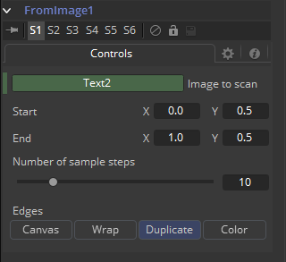
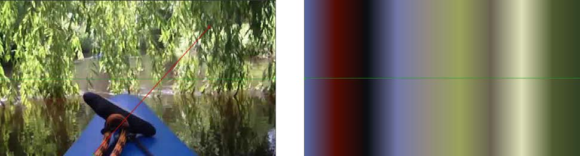

### From Image 自图像

From Image仅适用于渐变，如Background工具上的渐变。它沿着用户定义的线在图像上采样，并根据这些样本创建一个渐变。

它可以通过在Gradient（渐变）控件上右键单击并选择From Image来应用。

#### Controls 控件

##### Image to Scan 扫描图像

将要扫描的工具拖放到此框中。

##### Start X/Y, End X/Y 起始X/Y、结束X/Y

这两个点控件定义了从Image to Scan框中定义的图像中采样沿着的线条的起始点和结束点。

这两个点可以直接在视图中移动。

##### Number of Sample Steps 采样步长数

定义了沿着线条采集多少独立的色彩样本。查看实际工会据的Gradient控件时，你也可以看见该设置的结果。在此处定义的采样步长越大，你在Gradient控件中看见的独立点就越多。你也可以先使用From Image修改器创建一个渐变并在之后再从Gradient上移除该修改器。已经创建好的渐变并不会受到影响，并可以手动进行一些精细的调整。

##### Edges 边缘

Edges确定了当采样线延伸至采样图像实际边框之外时如何处理图像的边缘。

- **Black 黑色：**图像边界之外的采样线条上的每个点都会输出黑色。
- **Wrap 环绕：**这会绕着图像的边界环绕线条的边缘。
- **Duplicate 复制：**这会导致图像的边缘尽可能好地复制，在原始大小之外延续图像。
- **Color 颜色：**为图像边界之外的采样线条上的每个点都输出用户自定义的颜色而不是黑色。

##### Example 示例

左侧的源图像将选择线条显示为红色。

右侧的图显示该选择产生的渐变。

