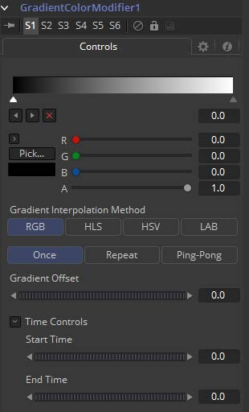

### Gradient Color Modifier 渐变色彩修改器

Gradient Color Modifier允许用户控制参数的值。将具有自定义值的渐变映射到特定时间范围来控制该值。如果两个时间值都设置为0，则修改器返回渐变的起点出的值。可以使用Offset控件来手动设置渐变动画。

它也可以通过右键单击控件并选择*Modify with > Gradient Color Modifier*应用。

#### Controls 控件

##### Gradient 渐变

Gradient控件由一个条组成，可以在其中添加、修改和删除渐变点。每个点都有它自己的颜色。可以对颜色以及点的位置进行动画处理。另外，也可以将From Image修改器应用于Gradient来从图像中进行核算。

##### Gradient Interpolation Method 渐变插值方法

渐变默认在RGB色彩空间中点至点线性插值。它有时也会产生不想要的颜色。选择其他的色彩空间也许会提供更好的结果。

##### Repeat 重复

定义如何处理渐变的左右边界。

自上到下分别将Gradient设置为Once、Repeat和Ping Pong，并将渐变移动至左侧。

- **Once 单次：**当使用Gradient Offset控件移动渐变时，边界颜色将保留它们的值。将默认渐变移至左侧会导致在右侧产生白色边界，移至右侧会导致在右侧产生黑色边框。
- **Repeat 重复：**当使用Gradient Offset控件移动渐变时，边界颜色将环绕。将默认渐变移至左侧会导致从白色突然跳到黑色，移至右侧则从黑色突然跳到白色。
- **Ping Pong 乒乓：**当使用Gradient Offset控件移动渐变时，边界颜色将来回“乒乓”。将默认渐变移至左侧会导致从白色渐变到黑色，移至右侧则从黑色渐变到白色。

##### Gradient Offset 渐变偏移

允许你平移渐变。

##### Time Controls 时间控件

Start Time和End Time拨轮控件确定了渐变所映射的时间范围。以帧为单位设置。同样的效果也可以通过将Gradient设置为Once并向Offset拨轮添加动画。

