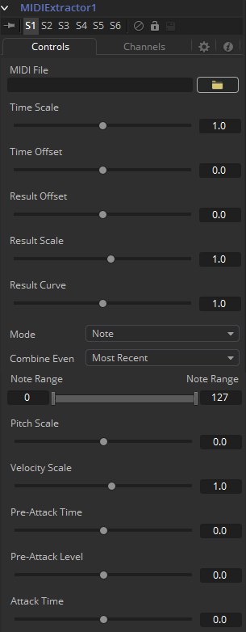
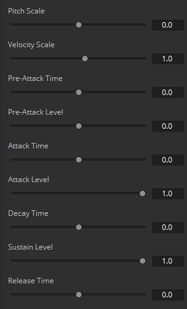
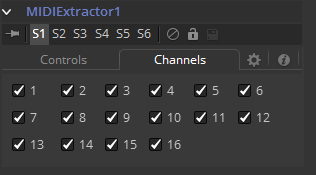

### MIDI Extractor MIDI提取器

MIDI Extractor修改器提供了使用存储在MIDI文件中值来修改控件值的能力。使用该修改器需要一些MIDI的知识，详细解释并不属于该手册的范畴。

（译注：所以我也不怎么懂具体什么意思，希望能有了解的人来补充一下。）

#### Controls 控件

##### MIDI File MIDI文件

该浏览器控件用于指定作为该修改器输入的MIDI文件。

##### Time Scale 时间缩放

Time Scale用于指定MIDI文件定义的和Fusion定义的时间之间的关系。值位1.0会以正常速度播放MIDI时间，2.0则为双倍速，等等。

##### Time Offset 时间偏移

Time Offset调整MIDI文件时间和Fusion时间之间的同步。如果存在不想要的延迟或MIDI文件出现在Fusion动画之前或一半进入的时候，可能使用该控件来按需要偏移MIDI数据。

##### Result Offset, Result Scale 结果偏移、结果缩放

这些滑块调整该修改器产生的值范围。默认地，会生成0与1之间的值（PitchBend为-1与1）。这将会不适合工具/参数，那么缩放将用于将范围变得更大（例如\* 0.0 - 2.0）。Offset用于提供一些常量作为基础。

##### Result Curve 结果曲线

Result Curve可以用于调整输出，调整结果的曲线。默认情况下，对于任何输入MIDI文件，结果会线性地落在0.1至1.0（比如，速度chanshe127音符会生成1.0，而63会生成大概0.5）.

结果曲线应用了一个类似伽马的曲线，所以中间值可以更高或更低的结果并仍然维持完整的比例。

##### Mode 模式

该菜单提供了Beats、Note、Controls Change、Poly AfterTouch、Channel AfterTouch或Pitch Bend，用于指示哪个MIDI事件会被读取。Beats模式稍有不同，它会根据MIDI文件的速度（包括任何速度映射）产生常规脉冲。

Beats模式不会真正使用任何特定的信息。它的事件时间基于MIDI文件中包含的速度映射。

##### Combine Events 结合事件

该菜单选择同一事件出现多个事件时发生哪一件。在Notes模式中，这很容易发生。对于其他事件，可能会在Multiple Channels选择时发生。

使用这个来从当前出现的所有事件中选取最近出现的事件、最早出现的事件、最高或最低值的事件、平均、求和或中位事件。

##### Beat (Quarters) 节拍（四分音符）

[仅Beat模式]这定义了Beat模式中节拍出现的频率。因为处于四分音符中，所以值为1.0表示每个四分之一小节给出一拍。

##### Note Range 音符范围

[仅Note和Poly Aftertouch模式]这定义了会生成哪些范围的节拍会生成值。例如，通过将音符范围设置在35-36之间，可以从GM鼓音轨中拾取底鼓的声音。

##### Pitch Scale 音调缩放

[仅Note模式]Pitch Scale定义了结果受音调改变的程度。值为1.0会导致结果在整个范围中从0.0变化至1.0。

##### Velocity Scale 速度缩放

[仅Note模式]这定义了结果受速度改变的程度。值为1.0会导致结果在整个范围中从0.0变化至1.0。这将被加到Pitch Scale的结果上来获得最终结果。

##### Control Number 控制数

[仅Control Change模式]这指定了T要提取事件的MIDI控制器数。

##### Envelope Controls 波封控件

[仅Note和Beat模式]这些定义了一个波封，用于音符或节拍之前、之中或之后的值。Attack（起音）是事件发生后逐渐增加的时间/级别，然后接着的是Decay（衰减）和Sustain（延持）增加，直至事件停止。该场景仅用于Notes。Beats具有瞬间持续时间，所以直接进入Release（释音）。Release（释音）是事件结束后的下降时间。档尝试进行节拍时，将Release（释音）设置为某值，否则节拍可能不会太大。

这些值可以用于跟随MIDI序列中的真实声音，或只是创建有趣的效果。MIDI Extractor中用到的时间值都是以秒为单位的。

#### Channels Tab 通道选项卡

##### Channels 通道

Channels复选框选择MIDI文件中的16个通道中的哪些用于事件。这是一个很好的从一个编排中挑出特定乐器的方法。

#### More About MIDI 更多关于MIDI

单个MIDI接口允许16个通道。通常这些会被分配给一个或不同设备中不同的乐器。

通常，MIDI数据为7位，范围为0..127。这里使用0..1的值来表示，使得与Fusion中的处理其他值具有一致性。

有很多MIDI消息和事件，该修改器中特别有用的那些在下方详细描述。

##### MIDI Messages MIDI消息

##### MIDI Messages MIDI消息

- **Note On 音符开：**这指示了（特定轨道上的）一个音符被打开，拥有音调（0..127，中央C为60）和速度（0..127，键等敲击的速度）。
- **Note Off 音符关：**这指示了（特定轨道上的）一个音符被关闭，拥有音调（0..127，中央C为60）和速度（0..127，键等释放的速度）。
- **Control Change 控件改变：**该信息指示一些控制器已经改变。有128个控制器（0..127）每一个都拥有0..127的数据。控制器用于设置如Volume（音量）、Pan（声像）、Reverb（混响）量或Chorus（合唱）以及诸如脚控制器或呼吸控制器等常规东西。

##### MIDI Events MIDI事件

- **Channel Aftertouch 通道触后：**该事件定义了音符中按键（等）被施加压力。这是通道普遍、整体的压力，所以它只是简单地使用压力值（0..127）。
- **Poly Aftertouch 和弦触后：**该事件定义了音符中按键（等）被施加压力。这是对每个音符特定的，因此包含了音符数和压力值（0..127）。

#### General 一般

##### Pitch Bend 弯音

Pitch Bend控制器一般指定应用于音符的弯音或变化。因为弯音值是以14位值传输的，所以此控件的范围为-1至1，且拥有相应更清晰的解析。

对于MIDI如何工作的资源，查阅http://www.harmony-central.com/MIDI/Doc/doc.html。

