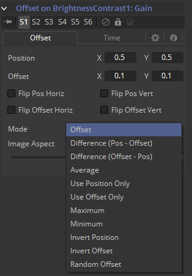

### Offset 偏移

Offset可用于在值之间创建与各种控件、路径和点有关的恒定或动态的变化。Fusion中提供了三种类型的偏移：

- Offset Distance 偏移距离
- Offset Angle 偏移角度
- Offset Position 偏移位置

##### Offset Angle 偏移角度

Offset Angle修改器根据两个位置控件之间的角度输出0至360之间的值。Position和Offset参数可以是静态的，也可以连接到其他位置参数，或连接到它们自己的路径。所有偏移都使用相同的控件集，行为根据所使用的偏移类型而有所不同。 这些控件在下方介绍。

##### Offset Distance 偏移距离

Offset Distance修改器根据两个位置控件输出值。该修改器是讨论的第一个可以基于应用到位置的数学表达式输出值的。

##### Offset Position 偏移位置

Offset Position修改器根据位置控件间的关系输出位置（X和Y坐标）。该修改器等价于Calculation控件，无非是它输出了X和Y坐标而不是值。

它可以通过在控件上右键单击并选择*Modify with > Offset*。

#### Offset Tab 偏移选项卡

##### Position X and Y 位置X和Y

用于Position生成Calculation的第一个位置。

##### Offset X and Y 偏移X和Y

用于Offset生成Calculation的第一个位置。

##### Flip Position Horizontal and Vertical 翻转位置水平和垂直

当选中这些控件时，Position会根据图像的垂直和水平轴镜像。

##### Flip Offset Horizontal and Vertical 翻转偏移水平和垂直

当选中这些控件时，Offset位置会根据图像的垂直和水平轴镜像。

##### Mode 模式

在Mode菜单中选择一个数学运算来让偏移控件运算。

有以下可用选项：

- Offset 偏移
- Difference (Position - Offset) 差别（位置 - 偏移）
- Difference (Offset - Position) 差别（偏移 - 位置）
- Average 平均
- Use Position Only 仅使用位置
- Use Offset Only 仅使用偏移
- Maximum 最大
- Minimum 最小
- Invert Position 反转位置
- Invert Offset 反转偏移
- Random Offset 随机偏移

##### Image Aspect 图像宽高比

调整修改器的输出来补偿该项目的图像宽高比（而不是像素宽高比）。500×500的正方形图像使用的图像宽高比值为1，而500×1000的矩形图像使用的宽高比值为2。默认值总是基于偏好设置中选择的当前帧格式。图像宽高比指宽度除以高度。该控件也可以用于创建宽高比的错觉。

#### Time Tab 时间选项卡

##### Position Time Scale 位置时间缩放

这将返回指定时间缩放上的Position值（例如，0.5指当前帧时间一半处的值）。

##### Position Time Offset 位置时间偏移

这将返回指定时间偏移处的Position值（例如，10指10帧之后处的值）。

##### Offset Time Scale 偏移时间缩放

这将返回指定时间缩放上的Offset值。

##### Offset Time Offset 位置时间偏移

这将返回指定时间偏移处的Offset值。

#### Example 示例

1. 让我们继续这章开头的文本示例来说明Offset的一种可能的用法。
2. 选中并查看流程中的Merge工具。右键单击Merge Size控件并在上下文菜单中选择*Modify With > Offset Distance*。这会在Modifier选项卡中添加两个新的十字光标和Offset控件。
3. 文本的大小现在会由两个十字光标间的距离来决定。这些点可以添加动画并连接至其他控件。
4. 通过在Position控件上右键单击并选择*Connect To > Path on Merge 1 Center Value*可以将Offset的位置值连接至现存的路径。手动将Offset十字光标放置在两个路径点之间的屏幕底部。
5. 现在，文本应在路径的中间附近缩小（当偏移和路径之间的距离最小时），并在其两端增加（偏移和路径之间的距离最大时）。

