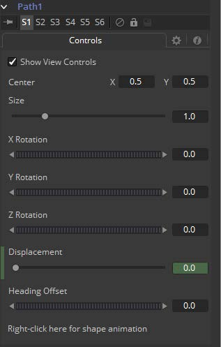

### Path 路径

Path使用两个样条曲线来控制点的动画。屏上的运动路径（空间）和样条编辑器中的时间样条（时间）可见。要使用Path为Coordinate（坐标）控件添加动画，在控件上右键单击并从上下文菜单中选择*Path*。

#### Controls 控件

对于更深入的解释，参阅本手册中的“Working with Motion Paths 使用运动路径”一章。

##### Center 中心

该路径的实际中心。同样可以被修改或添加动画来移动整个路径。

##### Size 大小

路径的大小。也允许添加动画来修改。

##### X/Y/Z Rotation X/Y/Z旋转

Path可以在三个轴上旋转来允许一些复杂的动画。

##### Displacement 位移

每个运动路径都在样条编辑器中由一个相关联的Displacement样条。该Displacement样条表示添加动画控件沿着该路径的位置，用0.0至1.0之间的值表示。Displacement样条用于控制控件沿着它的路径的移动速度。

要减速、加速、停止甚至反转控件沿着路径的运动，调整样条编辑器中Path的Displacement上点的值。

- 样条编辑器中Displacement的值为0.0表示该控件位于路径的正开始处。
- 值为1.0表示控件位于路径的结束处。
- 每个运动路径上锁定的点都会在Displacement样条上有关联的点。未锁定的在Displacement样条上没有对应的点。对于更深入的解释，参阅本手册中的“Working with Motion Paths 使用运动路径”一章。

##### Heading Offset 起始偏移

如果将另一个控件（例如某遮罩的的Angle）连接到了路径的起始，则该控件允许从计算出的角度中添加或减去。

##### Right Click Here for Shape Animation 右键单击此处以创建形状动画

也可以对路径的形状进行动画处理，或将其连接到其他路径控件，如Polyline Mask或Paint Stroke。

##### Switching Default Paths 切换默认路径

将向坐标控件添加动画时使用的默认路径类型更改为Path（如果这是首选的动画类型）。打开Global Preference（全局偏好设置），在Default选项卡下寻找Default animate组中的Point With标记的下拉菜单，将它从当前值更改为Path。下次从坐标控件的上下文菜单中选择Animate时，将使用Path。