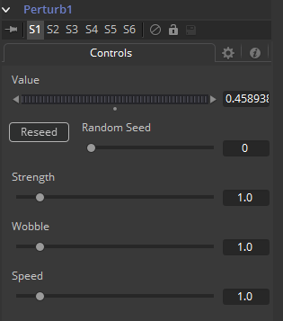
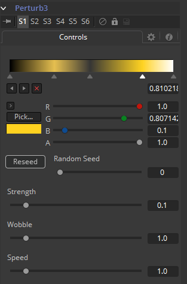

### Perturb 扰动

Perturb修改器基于Perlin噪声为几种输入类型生成平滑变化的随机值。它可以用于向任何可设置动画的控件（即使该控件已经设置了动画）添加抖动、摇动或摆动。它的结果与Shake修改器的结果相似，不过它使用了一组可能更适合您需要的控件。与其他随机修改器不同，Perturb修改器还可以应用于多边线、形状、网格mesh甚至颜色渐变。

举个例子，要对一个现存的路径添加摄像机摇晃，右键单击十字光标并选择*Insert > Perturb*，然后调低Strength到合适的值。另外也可以右键单击路径的Shape Animation（形状动画）控件然后向路径的多边线本身应用摆动（这最适合多边线拥有很多点的时候，比如是跟踪得到的或使用Draw Append铅笔工具手绘的）。第三种方法是在Displacement控件上插入该修改器，这会导致沿着该路径的运动前后抖动，但实际上并不会脱离路径线。

> **注意：**Perturb只可以添加抖动而不能平滑现存的运动曲线。

#### Controls 控件

##### Value 值

该控件实际的内容要取决于该修改器所应用的控件类型。如果Perturb修改器被添加到一个基础的滑块控件上，那么Value就是一个滑块。如果被添加到渐变控件上，在这里就会显示渐变控件。使用该控件来设置Perturb工作的默认、中间值。

##### Jaggedness 锯齿度

（仅多边线、Mesh）这允许你增加沿着多边线或mesh的长度而不是时间变化的量。增加该值会给出一种多边线更弯曲而mesh更缠绕，而与运动本身无关。

##### Phase 相

（仅多边线、Mesh）该动画处理可用于移动多边线的涟漪或两端沿着自身的mesh。当速度设置为0.0是，可以清晰地看见该效果。

##### Random Seed 随机种子

Random Seed用于设置该修改器应用抖动量的“种子”。两个Perturb修改器拥有相同设置，但种子不一样，会产生完全不一样的结果。

##### Randomize 随机化

点击Randomize按钮来重新分配一个随机种子。

##### Strength 强度

使用该控件来调整Perturb修改器输出的强度，或相对上述基础指定值的最大变化量。

##### Wobble 摆动

使用Wobble控件来确定结果值的平滑程度。较小摆动会产生值之间更平滑的过渡，而较大的摆动会产生更难预测的结果。

##### Speed 速度

增加Speed滑块会加速值变化的速率。这会比Wobble控件以更易预测形式增加摆动程度，并使抖动变得更有疯狂感。