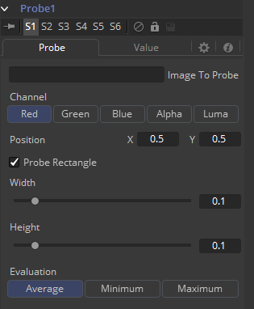
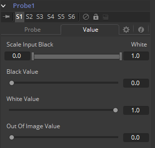

### Probe 探针

Probe修改器是Fusion中用途最广泛的修改器之一。它允许您通过图像的特定位置或矩形区域的像素颜色或亮度来控制任何数值参数。想一想通过图像的存在或不存在或图像的颜色值来驱动一个值、使用颜色在其他控件上创建XY位置，或测量调色的LUT来比较值。

它可以通过在控件上右键单击并选择*Modify with > Probe*来应用。

#### Probe Tab 探针选项卡

##### Image to Probe 探测图像

将你想要探测的图像拖入该区域。

##### Channel 通道

选择你想探测的通道。一般选项有：

- Red
- Green
- Blue
- Alpha
- Luma

Probe修改器出现在合成中的某个位置后，也可以将其他工具的值连接到其输出。Probe允许独立地连接它的值：

- Result
- Red
- Green
- Blue
- Alpha

##### Position X/Y 位置X/Y

探针在图像中采样值的位置。

##### Probe Rectangle 探针矩形

默认情况探针只采样该位置的单个像素。通过使用Probe Rectangle模式，你可以根据Evaluation方法采样较大区域的像素。

##### Width/Height 宽度/高度

确定要探测区域的大小。

##### Evaluation 核算

设置矩形内部像素如何计算得到输出值。

有这些选项：

- Average 平均（矩形中所有像素的平均值）
- Minimum 最小值（矩形中所有像素的最小值）
- Maximum 最大值（矩形中所有像素的最高值）

#### Value Tab 值选项卡

##### Scale Input Black/White 缩放输入黑/白

默认情况下，Probe会在探测区域结果为值0（即黑色）时生成Black Value，在探测区域结果为值1（即白色）时生成White Value白值。通过该范围控件，你可以修改Probe的灵敏度。

##### Black Value 黑值

探测区域递交的值处于Scale Input Black中时Probe生成生成的值。

##### White Value 白值

探测区域递交的值处于Scale Input White中时Probe生成生成的值。

##### Out of Image Value 图像之外的值

探测区域在探测图像帧边界之外时Probe生成的值。如果探测的是矩形，那么值只会在整个矩形处于探测图像的帧边界之外时生成。

