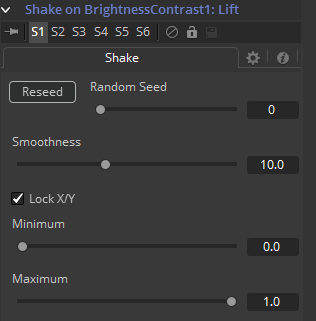

### Shake 摇动

Shake修改器用于随机化一个位置或值控件来创建半随机的数值输入。结果摇动可以时完全随机的。运动也可以变得更平滑来变得更细微、生机感。

要向一个控件添加Shake修改器，从控件的上下文菜单中选择*Modify With > Shake*。Shake修改器使用下列控件来完成它的效果，它可以通过右键单击控件并选择*Modify With > Shake*来应用。

#### Shake Tab 摇动选项卡

##### Random Seed 随机种子

Random Seed控件包含了用于为随机数生成器提供种子的值。给定相同的种子，随机数生成器总是会生成相同的结果。如果随机化器中得到的不够满意，那就更改它的种子。

##### Smoothness 平滑度

该控件用于平滑Shake的全局随机度。该值设置越高，运动就看起来越平滑。值为0会生成完全随机的结果，不应用任何平滑。

##### Lock X and Y 锁定X和Y

该复选框用于解锁X和Y轴，显示出每个轴独立的滑块控件。

##### Minimum/Maximum 最小值/最大值

该控件用于确定抖动的全局强度。较低的值表示随机化器可生成的Minimum，而Maximum表示最高的值。要创建一个中心十字光标在图像中任意位置移动的摇动，将Minimum设置为0.0，Maximum为1.0。要将运动限定为图像右下角更小的摇动，将Minimum设置为0.70，Maximum为0.90。

#### Example 示例

1. 创建一个合成并添加Text+工具。
2. 向Text+工具键入一些文字并在大屏幕上查看。
3. 通过在上下文菜单中选择*Modify With > Shake Position*来向Text+的Center控件添加Shake。
4. 切换至Modifier选项卡并将Smoothness设置为5.0。
5. 将Minimum设置为0.1，Maximum设置为0.9。
6. 在第0帧向Minimum和Maximum控件各添加一个Bezier Spline。
7. 前进至第90帧并将Minimum设置为0.45，Maximum设置为0.55。
8. 渲染出预览并查看结果。
9. 文字应先从屏幕上方飞过，然后向屏幕中央靠紧。

