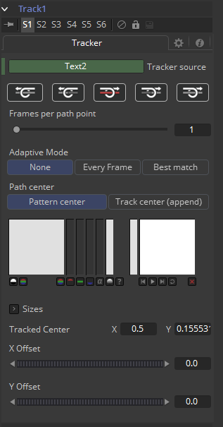

### Track 跟踪

另一个将跟踪器之间添加至控件的技巧是将Tracker应用为修改器。右键单击遮罩中心并选择*Ellipse x Center > Modify With > Tracker Position/Steady Position/Unsteady Position*。这会添加一个与Tracker工具本身中控件几乎完全相同的修改器。

#### Tracker Tab 跟踪器选项卡

对于该工具更深入的解释，参阅本手册中的Tracker文档。

##### Tracker修改器和Tracker工具之间的区别如下所述：

- Tracker修改器只能跟踪单个图案。
- Tracker修改器必须设置一个源图像。
- Tracker修改器只能输出一个单独的值，不能用于复杂的稳定处理。
- 该修改器的默认源图像是包含该修改器的工具的直接上游（当添加一个Tracker修改器至Loader为输入的Glow工具上时，Tracker Source输入会默认连接至Loader输出）。通过键入工具的名称来设置Tracker跟踪器不同的源图像。另外也可以从流程中拖拽源工具放到Text Box控件中。

#### Example 示例

想象你需要跟踪一个演员的眼球，来对其应用怪异的、外星人一般的发光。添加Glow工具并创建一个Ellipse遮罩盖住眼球的形状。右键单击遮罩的中心并选择*Modify with > Track*。然后跟踪眼球。