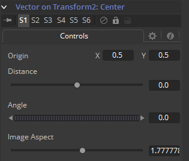

### Vector 矢量

Vector修改器用于以距离和角度偏移位置控件，例如十字光标。这些可以是静态或动画的值。

它可以通过右键单击控件并选择*Modify with  > Vector*来应用。

#### Controls 控件

##### Origin 原点

该控件用于表示矢量距离和角度值出发的位置。

##### Distance 距离

该控件用于确定矢量从原点的距离。

##### Angle 角度

该控件用于确定矢量相对原点的角度。

##### Image Aspect 图像宽高比

该控件用于补偿图像宽高比差异。500×500的正方形图像使用的图像宽高比值为1，而500×1000的矩形图像使用的宽高比值为2。默认值总是使用宽度/高度取基于当前Frame Format（帧格式）的偏好设置。也许有必要用到该控件来匹配当前图像。

#### Example 示例

1. 为了说明，创建一个包含黑色背景、Text+工具和Merge的简单流程。
2. 右键单击Merge的Center并选择*Modify With > Vector*。这会添加一个Vector修改器。拖拽Distance控件来是文本与矢量原点保持距离。
3. 拖拽Angle指轮控件来使文本绕原点旋转。
4. 通过右键单击Origin并从上下文菜单种选择*Path*选项来为矢量原点添加一个路径。检查当前帧设置为第0帧，拖拽Vector Origin十字光标至屏幕的左下角。
5. 右键单击Vector Angle指轮并选择*Bezier Spline*来为该控件添加动画。
6. 将Angle指轮的值设置为10。
7. 前进至第100帧并单击屏幕的左上角来移动矢量十字光标。
8. 将Vector Angle指轮的值设置为1000，这会导致文本绕着刚刚创建的路径公转。

