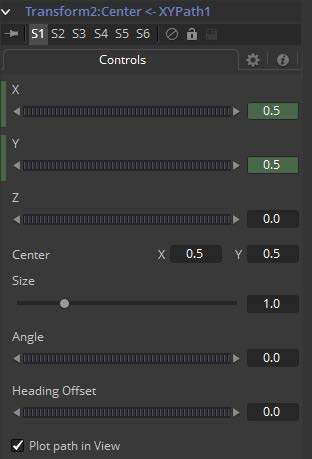

### XY Path XY路径

XY Path类型使用了位置沿着X轴独立的样条，以及位置沿着Y轴的。

要使用XY Path来为坐标控件添加动画，右键单击控件并从上下文菜单种选择*Modify With > XY Path*。

咋看一眼，XY Path工作的像Displacement路径一样。要描述该路径，更改帧并将其定位在该帧时应该处于的位置，然后再次更改帧并移动该控件至新的位置。Fusion会自动在点之间插值。区别是在屏上路径种没有创建关键帧。

查看Spline Editor（样条编辑器）并找到X和Y通道样条。对于控件位置的更改会在样条上创建关键帧。XY Path的优点是它对于独立轴的运动处理会变得非常简单。

#### Controls 控件

##### X/Y/Z X/Y/Z

这些反映了动画的控件的位置。

##### Center 中心

路径的实际中心。这也可以修改或添加动画来移动整个路径。

##### Size 尺寸

路径的尺寸。同样允许进一步修改或添加动画。

##### Angle 角度

路径的角度。同样允许进一步修改或添加动画。

##### Heading Offset 起始偏移

如果将另一个控件（例如某遮罩的的Angle）连接到了路径的起始，则该控件允许从计算出的角度中添加或减去。

##### Right Click Here for Shape Animation 右键单击此处以创建形状动画

也可以对路径的形状进行动画处理，或将其连接到其他路径控件，如Polyline Mask或Paint Stroke。

##### Switching Default Paths 切换默认路径

将向坐标控件添加动画时使用的默认路径类型更改为XY Path（如果这是首选的动画类型）。打开Global Preference（全局偏好设置），在Default选项卡下寻找Default animate组中的Point With标记的下拉菜单，将它从当前值更改为XY Path。下次从坐标控件的上下文菜单中选择Animate时，将使用XY Path而不是Displacement路径。