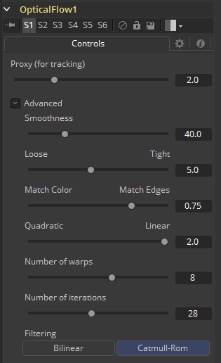

### Optical Flow [OF] 光流

该工具计算输入序列帧之间的光流（Optical Flow）。光流可以看作是每个像素在两帧之间匹配特征的位移矢量。

计算出的光流将存储在输出图像的Vector（矢量）和BackVector（反向矢量）辅助通道中。在其最高质量设置下，Optical Flow工具的处理速度可能很慢。如果发现光流太慢，则应考虑调整质量设置、使用磁盘缓存或将其预渲染为OpenEXR文件。

这其中有一些可以调整的质量设置，不少只是较小的反馈。通过更改设置，渲染时间很容易会有10倍的变化。对于想减少处理时间来说，可以尝试使用Proxy（代理）、Number of Iterations（迭代次数）和Number of Warps（扭曲数量）滑块，并将滤镜更改为Bilinear（双线性）。

Optical Flow会只在允许的帧上工作。如果将上游Loader修剪到一个子帧范围，Optical Flow将看不到子帧范围之外的内容，即使磁盘上有其他可用的帧。

如果输入的素材在逐帧闪烁，那么最好事先对素材进行去闪烁。

目前，Optical Flow必须渲染两次才能让下游的Time Stretcher或Time Speed进行计算。这是因为Time Speed需要A.FwdVec和B.BackVec（两个通道）才能工作，但Optical Flow在处理时只会生成A.BackVec和A.FwdVec。

在预生成光流矢量时，考虑在启用正向/反向矢量平滑之后添加Smooth Motion工具。

#### 输入/输出

##### Input 输入

要计算光流的图像序列。

##### Output 输出

将光流存储在其Vector和Back Vector通道中的图像序列。

#### Controls 控件

##### Proxy (for tracking) 代理 (用于跟踪)

输入图像会根据代理比例重新调整尺寸，再进行跟踪生成光流。此选项纯粹是为了加快光流的计算速度。计算时间大致与图像中的像素数量成比例。也就是说，代理比例为2将提供4倍的加速，而代理比例为3将提供9倍的加速。

#### Adcanved 高级

高级控制部分有用于调整光流矢量计算的参数控件。默认设置已被选为最佳默认值，这是从许多不同的镜头实验中得到的，应该作为一个良好的标准。在大多数情况下，不需要调整高级设置。

##### Smoothness 平滑度

这控制了光流的平滑度。较高的平滑度有助于处理噪声，而较低的平滑度会产生更多细节。

##### Edges 边缘

此滑块是另一种控制平滑度的控件，但其应用平滑基于的是颜色通道。它往往具有确定流程中边缘如何跟随彩色图像中的边缘效果。当设置为Loose（松散）时，光流变得更平滑并倾向于超出边缘。当设置为Tight（紧密）时，彩色图像中的细节开始继承到光流中，这不是理想的效果，并且流程中的边缘与彩色图像中的边缘更加紧密对齐。一个粗略的准则，如果您使用视差来产生类似DoF（景深）的后期效果Z通道，那么最好是Tight，如果您使用视差来做插值计算的，那么您可能需要更Loose一些。

一般来说，如果过于Tight，当使用光流进行插值计算时，可能会存在划出边缘的问题。

##### Match Weight 匹配权重

这控制如何匹配后续图像中的相邻区域。设置为Match Color（匹配颜色）时，将匹配大型结构性颜色特征。当设置为Match Edges（匹配边缘）时，将匹配颜色中的较小的突变。通常，此滑块处于[0.7, 0.9]范围内的最优，但在某些镜头中，接近于0.0的值工作也很不错。如果将此选项设置得更高，则会由于左右图像之间平滑变化的阴影或局部照明变化而出现差异，从而提高匹配结果。若有必要，用户仍应在初始图像上进行颜色匹配或去闪烁，以使它们尽可能相似。此选项还有助于处理局部变化，例如光线通过镜子时产生的照明差异。

##### Mismatch Penalty 不匹配补偿

此选项控制当不匹配区域变得更加不相似时，对不匹配区域的补偿如何增长。滑块可在Quadratic（二次方）补偿和Linear（线性）补偿之间进行选择。Quadratic强烈地补偿了较大的不相似，而Linear对不相似匹配更为稳健。将此滑块向Quadratic移动会产生更多随机小变化的差异，而Linear会产生更平滑、更美观的结果。

##### Number of Warps 扭曲数量

调低此选项可加快光流计算速度。事实上计算时间与该选项线性相关。要了解此选项的作用，您需要了解光流算法会逐步扭曲一张图片，直到它与另一张图像匹配。在某些点之后，达到收敛之后的额外扭曲只会是浪费计算时间。Fusion中的默认值设置得足够高，因此应该始终达到达到收敛。你可以调整一下该值来加快计算速度，但最好同时观察一下光流的作用。

##### Number of Iterations 迭代次数

调低此选项可加快光流计算速度。事实上计算时间与该选项线性相关。就像调整扭曲数量一样，在某些点上，将此选项调得更高会产生递减效果并且不能产生明显好转的结果。默认情况下，该值设为收敛所有可能的镜头，且经常可以在不降低视差质量的情况下调成更低的值。

##### Filtering 滤镜

此控制是在光流生成期间使用的滤镜操作。Catmull-Rom滤镜将产生更好的结果，但同时，打开Catmull-Rom会大幅增加计算时间。