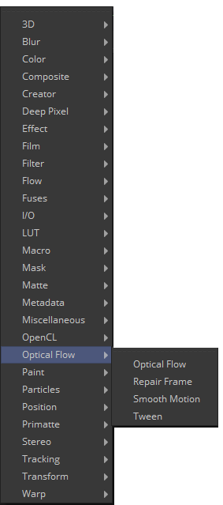

## 第二十二章 Optical Flow 光流

- [Optical Flow [OF] 光流](./Optical%20Flow%20[OF].md) 
- [Repair Frame [Rep] 修复帧](./Repair%20Frame%20[Rep].md) 
- [Smooth Motion [SM] 平滑运动](./Smooth%20Motion%20[SM].md) 
- [Tween [Tw] 中间帧](./Tween%20[Tw].md)

<table id="img">
  <tr>
    <td rowspan="4"></td>
    <td></td>
  </tr>
  <tr>
    <td></td>
  </tr>
  <tr>
    <td></td>
  </tr>
  <tr>
    <td></td>
  </tr>
</table>
