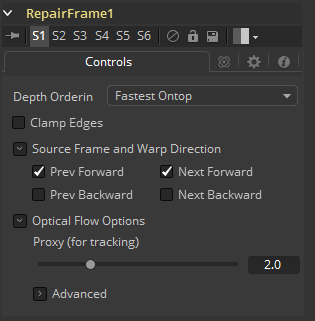

### Repair Frame [Rep] 修复帧

Repair Frame用于替换损坏或丢失的帧或部分带有划痕及其他短暂伪影的帧。

您可以使用遮罩输入将修复限制在特定区域。如果每一帧的素材颜色都不同，有时修复会很明显，因为需要填补漏洞，Repair Frame需要从相邻帧中提取颜色值。可以考虑使用一些去闪烁、色彩校正和/或使用柔边遮罩来帮助减少此类型的伪影。

Repair Frame通过检查自身的两个相邻帧来替换部分单帧，因此需要三个连续帧，而不是像Time Stretcher/Time Speed那样在两个连续帧之间工作来创建一个新的中间帧。

与Time Stretcher和Time Speed不同，Repair Frame不需要输入Vector（矢量通道）/Back Vectors（反向矢量通道）才能工作，也不需要上游存在Optical Flow节点。

Repair Frame会在内部计算它所需要的光流。这会使处理速度变慢。计算完成后，Repair Frame不会透过而会破坏所有辅助通道。

有关控件和设置信息，请参阅Optical Flow（光流）工具。

#### Controls 控件

##### Depth Ordering 深度排序

Depth Ordering用于确定图像的哪些部分应在顶部渲染。最好用一个例子来解释：

在固定机位的镜头中，汽车在画面中移动而背景不会移动，因此背景会产生较小或较慢的矢量，而汽车会产生较大或较快的矢量。

在这种情况下，深度排序为Fastest Ontop（最快的置顶），来将汽车绘制在背景上。

而在相机平移跟随汽车的镜头中，背景会有较快矢量，汽车会有较慢的矢量，因此深度排序方法为Slowest Ontop（最慢的置顶）。

##### Clamp Edges 夹拢边缘

在某些情况下，此选项可以移除插值帧边缘上可能出现的透明间隙。夹拢边缘会导致帧边缘附近的拉伸伪影，当对象移动或相机移动时，该伪影尤其明显。

由于这些伪影的存在，最好只使用夹拢边缘来校正插值帧边缘周围较小的间隙。

##### Softness 柔和度

有助于减少夹拢边缘后可能引入的拉伸伪影。

如果勾选了Source Frame and Warp Direction（源帧和扭曲方向）下的多个复选框，则可能会导致边缘附近的拉伸效果加倍。在这种情况下需要将柔和度保持在0.01左右。如果您只勾选了一个复选框，则可以在0.03左右使用较大的柔和度。

##### Source Frame and Warp  Direction 源帧和扭曲方向

该控件集允许选择使用哪些帧和哪些矢量来创建中间帧。勾选的每种方法都将混合到结果中。

- **Prev Forward 前帧正向：**将采用上一帧并使用正向矢量插值计算新的一帧。
- **Next Forward 后帧正向：**将采用序列中的下一帧并使用正向矢量插值计算新的一帧。
- **Prev Backward 前帧反向：**将采用上一帧并使用反向矢量插值计算新的一帧。
- **Next Backward 后帧反向：**将采用序列中的下一帧并使用反向矢量插值计算新的一帧。
- **Advanced 高级：**请参阅Optical Flow的“Advanced Controls 高级控件”章节。