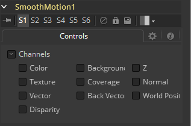

### Smooth Motion [SM] 平滑运动

此工具对图像序列使用光流对其进行平滑处理以查看相邻帧。

输入序列中必须包含预先计算的Vector和BackVector通道，否则此工具会输出错误消息。

检查想要临时平滑的通道。如果选择的用于平滑的通道不存在，Smooth Motion不会失败，也不会打印任何错误消息。

Smooth Motion最初设计是用于平滑Disparity（视差）通道，它有助于减少临时边缘/须边伪像。

它也可以用于平滑Vector和BackVector通道，但是要注意在某种情况下，这可能会使插值结果变得更糟，尤其是在镜头中有相互冲突的运动或对象不规则地移动、抖动或快速反弹。

可以尝试的级联使用两个或多个Smooth Motion工具来获取更多的平滑。使用一个Smooth Motion工具，可以检查前一帧、当前帧和下一帧共3帧；使用2个Smooth Motion工具，检查5帧；使用3个Smooth Motion工具，检查7帧。

还可以尝试使用2个Smooth Motion工具，但是在第一个工具中启用对Vector和Back Vector通道进行平滑处理，并在第二个Smooth Motion中启用您想要平滑的通道（例如视差通道）。这样您可以使用平滑过的矢量通道来平滑视差通道。

也可以尝试使用平滑过的运动通道来平滑运动通道。

#### Controls 控件

##### Channel 通道

Smooth Motion不仅可以应用于RGBA通道，它还可以用于Fusion中所有其他的辅助通道组。