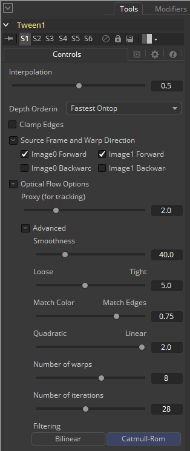

### Tween [Tw] 中间帧

Tween通过使用光流在两个帧之间进行插值来构造中间帧。Tween在功能上与Time Speed和Time Stretcher几乎相同。主要的区别在于它对两个不成序列的图像也起作用。因此它不能使用存储在图像中的Vector或Back Vector辅助通道，必须手动生成光流。它无需在上游添加Optical Flow工具。生成的光流将被丢弃并不会存储回输出帧中。

由于光流是基于颜色匹配的，因此最好提前对图像进行颜色校正来匹配。另外，如果您在噪声的图像上遇到麻烦，这也可能有助于提前去除一些噪声。

Tween将破坏任何输入的辅助通道。有关控制和设置信息，请参阅“Optical Flow（光流）”工具。

#### Inputs/Outputs 输入/输出

##### Input A 输入A

插值自的图像。

##### Input B 输入B

插值至的图像。

##### Output 输出

插值后图像。

#### Controls 控件

##### Interpolation Parameter 插值参数

此选项确定我们要插值的帧相对于两个源帧A和B的位置。插值参数为0.0将返回帧A，参数1.0将返回帧B，参数0.5将返回介于A和B之间的结果。

- ##### Depth Ordering 深度排序

  Depth Ordering用于确定图像的哪些部分应在顶部渲染。最好用一个例子来解释：

  在固定机位的镜头中，汽车在画面中移动而背景不会移动，因此背景会产生较小或较慢的矢量，而汽车会产生较大或较快的矢量。

  在这种情况下，深度排序为Fastest Ontop（最快的置顶），来将汽车绘制在背景上。

  而在相机平移跟随汽车的镜头中，背景会有较快矢量，汽车会有较慢的矢量，因此深度排序方法为Slowest Ontop（最慢的置顶）。

  ##### Clamp Edges 夹拢边缘

  在某些情况下，此选项可以移除插值帧边缘上可能出现的透明间隙。夹拢边缘会导致帧边缘附近的拉伸伪影，当对象移动或相机移动时，该伪影尤其明显。

  由于这些伪影的存在，最好只使用夹拢边缘来校正插值帧边缘周围较小的间隙。

  ##### Softness 柔和度

  有助于减少夹拢边缘后可能引入的拉伸伪影。

  如果启用了Source Frame and Warp Direction（源帧和扭曲方向）下的多个复选框，则可能会导致边缘附近的拉伸效果加倍。在这种情况下需要将柔和度保持在0.01左右。如果您只启用了一个复选框，则可以在0.03左右使用较大的柔和度。

  ##### Source Frame and Warp  Direction 源帧和扭曲方向

  该控件集允许选择使用哪些帧和哪些矢量来创建中间帧。勾选的每种方法都将混合到结果中。

- **Prev Forward 前帧正向：**将采用上一帧并使用正向矢量插值计算新的一帧。

- **Next Forward 后帧正向：**将采用序列中的下一帧并使用正向矢量插值计算新的一帧。
- **Prev Backward 前帧反向：**将采用上一帧并使用反向矢量插值计算新的一帧。
- **Next Backward 后帧反向：**将采用序列中的下一帧并使用反向矢量插值计算新的一帧。
- **Advanced 高级：**请参阅Optical Flow的“Advanced Controls 高级控件”章节。
