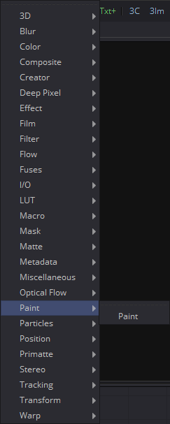
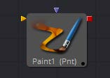

## 第二十三章 Paint Tools 绘画工具

- [Paint [Pnt]](./Paint%20[Pnt].md)
- [Hot Keys](./Hot%20Keys.md)
- [Modifiers](./Modifiers.md)
  - Circle
  - Clone Multistroke
  - Copy Ellipse
  - Copy Ployline
  - Copy Rectangle
  - Fill
  - Multistroke
  - Paint Group
  - Polyline Stroke

<table id="img">
  <tr>
    <td></td>
    <td></td>
  </tr>
</table>