### Modifiers

#### **Circle 圆**

Circle只用于Paint工具。创建一个圆形，并拥有可添加动画的半径和中心控件。它可以通过单击Paint工具的笔画菜单中的Circle按钮来应用。

#### Controls 控件

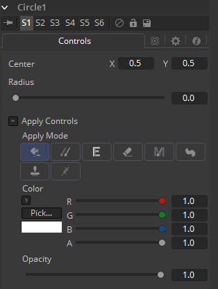

##### Center 中心

圆的中心。

##### Radius 半径

圆的半径。

##### Apply Mode 应用模式

细节请参阅Paint工具的应用控件（Apply Controls）。

##### Color 颜色

圆的颜色。

##### Opacity 不透明度

圆的不透明度。

#### **CloneMultistroke 克隆多笔画**

CloneMultistroke与Multistroke非常相像，但只用于将区域从一个图像复制到另一图像。除Multistroke之外，它还有源工具（Source Tool）输入，在本手册的后面会介绍。

- 完美胜任那么一帧上百笔画的像去除跟踪标记一类的润饰绘画作业。
- 比Stroke快很多但不支持后续的编辑。
- 它可以通过单击Paint工具的笔画菜单中的CloneMultistroke按钮来应用。

#### Controls 控件

不是所有在这里介绍的控件都会在所有模式中出现。某些控件只在特定的Paint模式中才有用处，并会在它们没有用处时隐藏。另外，一些控件也是不言自明的；Center控件的目的、Angle或Size控件也理解起来相对直白。

从简考虑，这些控件不是全部都介绍一遍。对于Controls选项卡上功能的更详细解释，请参阅本章的Working with Paint Strokes - Animating Strokes一节。

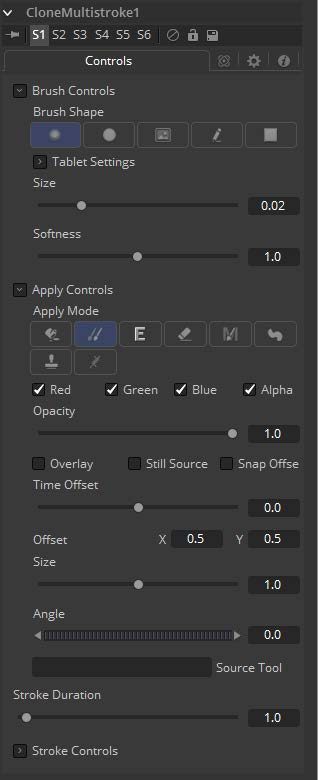

##### Brush Shape 笔刷形状

- **Soft Brush 软笔刷：**Soft Brush是一种拥有软边缘的圆形笔刷。按住Command或Ctrl键并拖动鼠标来在查看器中修改笔刷的尺寸。
- **Circular Brush 圆形笔刷：**Circular Brush是一种拥有硬边缘的笔刷形状。可以交互式地更改笔刷的尺寸。
- **Image Brush 图像笔刷：**Image Brush允许流程中或文件系统中的任何图像来用作笔刷。另见本章之后的Creating Custom Brushes。
- **Single Pixel Brush 单像素笔刷：**Single Pixel Brush可以完美胜任精细细节的工作，精准地创建尺寸为一像素的笔刷。在Single Pixel Brush上不会应用抗锯齿。
- **Square brush 方形笔刷：**Square Brush是一种拥有硬边缘的笔刷形状。

##### Vary Size 变化尺寸

- **Constant 恒定：**笔刷在整个笔画中拥有恒定的大小。
- **With Pressure 带压力：**笔画大小会随着实际施加压力的大小改变。
- **With Velocity 带速度：**笔画大小会随着绘制的速度改变。笔画越快，它就越细。

##### Vary Opacity 变化不透明度

- **Constant 恒定：**笔刷在整个笔画中拥有恒定的透明度。
- **With Pressure 带压力：**笔画透明度会随着实际施加压力的大小改变。
- **With Velocity 带速度：**笔画透明度会随着绘制的速度改变。笔画越快，它就越透明。

##### Softness 柔度

使用该控件来增加或减少软笔刷的柔度。

##### Image Source 图像源

当使用Image Source笔刷类型是，选择三种可能的源笔刷图像。

- **Tool 工具：**图像源派生自流程上工具的输出时，拖动工具到Source Tool输入来设置源。
- **Clip 片段：**图像源派生自磁盘中的图像或序列时，所有Fusion的Loader所支持的文件都可以使用。使用片段浏览器来选择原片段，使用文件名来定位文件。
- **Brush 笔刷：**存储在*Fusion>Brushes*中的图像会直接额比用作Paint工具的笔刷。在出现的菜单中选择笔刷。

#### Apply Controls 应用控件

##### Apply Mode 应用模式

- **Color 颜色：**Color应用模式简单地在屏幕上绘制着色的笔画。当与Image笔刷结合使用时，它也可以用于着色笔刷。
- **Clone 复制：**Clone应用模式拷贝图像的一部分至另一图像，或拷贝自同样的可调整位置和时间偏移的图像。任何流程中的图像都可用作源图像。
- **Emboss 浮雕：**Emboss应用模式对笔画覆盖的图像部分进行浮雕。
- **Erase 擦除：**Erase显露出被所有其他笔画覆盖的图像，会有效地擦除笔画一下的部分，实际上是销毁了这些笔画。
- **Merge 合并：**这一应用模式有效地将笔刷Merge进图像中。这一模式的行为很像Color应用模式但是没有色彩控件。该模式最适合用于Image笔刷类型。
- **Smear 涂抹：**以笔刷笔画的方向和强度为导向Smear图像。
- **Stamp 戳记：**将笔刷Stamp进图像中，完全忽略alpha通道或透明度信息。该模式最适合用于向目标图像应用印花。
- **Wire Removal 威亚擦除：**Wire Removal模式用于通过采样邻近像素并朝着笔画方向绘制来擦除线、骨骼和其他帧内的小元素。

#### Stroke Controls 笔画控件

##### Size 大小

当笔刷类型设置Soft或Circle笔刷时，该控件调整笔刷的大小。笔刷的直径在查看器中绘制为围绕鼠标指针的小圆圈。Size也可交互式地在查看器中通过按住Command或Ctrl键拖动鼠标指针调整。

##### Spacing 间距

Spacing滑块确定dab（用于沿着构成笔画或折线笔画的基础矢量形状绘制直线的样本）之间的距离。增大此滑块的值会增加笔画的密度，而减小该值很可能会使笔画看起来像虚线。

##### Stroke Animation 笔画动画

Stroke Animation菜单控件提供了多个预建的可以应用至绘画笔刷上的动画效果。该菜单只在Vector笔画时出现。

- **All Frames 所有帧：**默认显示项目的所有帧的笔画，其中Paint工具可以使用有效的目标图像。

- **Limited Duration 有限持续时间：**这只在Duration滑块指定帧数时出现。

- **Write On 写入：**选中Write On时，动画样条将添加到绘画笔画中，从而精确地复制绘画笔触的创建时间。笔画将完全按照绘制的方式写在图像上。若要调整Write On效果的时间，切换到Spline Editer（样条编辑器），然后使用Stretcher模式来调整动画样条线的总长度。若要平滑或手动调整其运动，可以尝试减少动画样条中的点。

- **Write Off 取消写入：**Write Off将执行与Write On相反的操作，从末尾开始绘制笔画，然后反过来至笔画开始处。

- **Write On Then Off 写入后取消写入：**该模式会向笔画线应用Write On，再应用Write Off。

- **Trail 尾随：**选中Trail模式将使笔触的起点和终点同时进行动画处理，彼此偏移持续时间控件中指定的量。这具有创建笔划的一部分的效果，该部分在笔划之后就像是一条路径。与Write On和Write Off的效果一样，此操作将从选择动画模式时当前的帧开始。可以使用样条（Spline）或时间线编辑器（Timeline Editer）手动调整动画的时间。

##### Duration 持续时间

Duration以帧为单位设置每个笔画的持续时间。仅在Multistroke或将笔画动画模式设置为Limited Duration时，此控件才会存在。它最常用于在场景中进行逐帧Roto。

  > **注意：**每个应用到场景的矢量笔画都会在Timeline（时间线）上有一个持续时间，并可分别地独立修剪每个笔画。持续时间可以设置为0.5，这会允许允许每个笔画只持续单个场，只在流程以Fields模式处理时。

##### Write On and Write Off 写开始和写结束

当Stroke Animation设置为Write On和Write Off方法之一时，将出现此范围滑块。该范围代表笔画的起点和终点。向上拖动低值产生删除笔画的感觉，或将高值从0.0拖动到1.0以产生在屏幕上绘制笔画的感觉。该控件可以添加动画来获得较好的效果。通过使用Stroke Animation菜单的Write On、Write off模式自动设置动画时，它会最有效地工作。

##### Make Editable 设为可编辑

该按钮只在Vector笔画时出现。单击Make Editable会将当前的笔画变成多边形样条来让图形变得可编辑或可添加动画。

#### **Copy Ellipse 拷贝椭圆**

Copy Ellipse只用于Paint工具。创建一个椭圆的形状，来将元素从图像的一个区域拷贝到另一图像。它可以通过单击Paint工具的笔画菜单中的Copy Ellipse按钮来应用。

#### Controls 控件

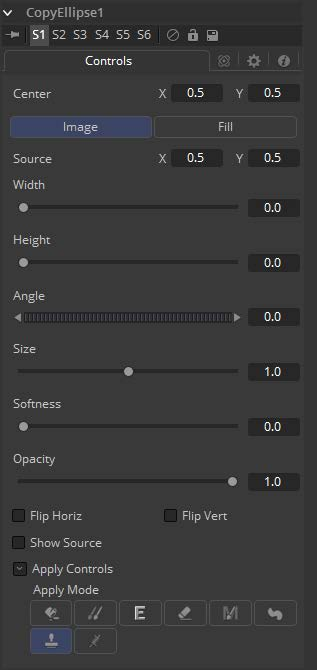

##### Center X Y 中心X Y

椭圆的中心，移动该控件来确定要拷贝内容至的位置。

##### Image 图像

要拷贝内容至目的位置的源。

##### Fill 填充

在目的位置创建填充的填充色。

##### Source Center X Y 源中心X Y

源椭圆的中心。移动该控件来确定内容拷贝自的位置。激活Show Source来显示屏幕控件。

##### Width/Height 宽度/高度

椭圆的宽度和高度，可以通过屏幕控件来修改。

##### Angle 角度

椭圆的旋转，可以通过屏幕控件来修改。

##### Size 大小

椭圆的整个大小。这是Width和Height设置的乘数。

##### Softness 柔度

椭圆边缘的柔度。

##### Opacity 不透明度

输出的整个不透明度。

##### Filp Horiz/Filp Vert 翻转水平/翻转垂直

该椭圆内的区域将会被水平和/或垂直翻转。

##### Show Source 显示源

显示屏幕控件来调整源椭圆的位置。

##### Apply Mode 应用模式

细节请参阅Paint工具的“Apply Controls 应用控件”一节。

#### **Copy Polyline**

Copy Polyline只用于Paint工具。它创建了一个用户可定义的多边线将元素从图像的一个区域克隆到另一图像。详见本手册的“Polylines and Rotoscroping 多边线和Roto”一章。它可以通过单击Paint工具的笔画菜单上的Copy Polyline来应用。

#### Controls 控件

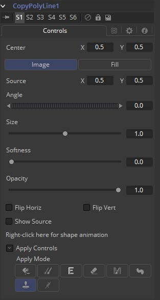

##### Center X Y 中心X Y

椭圆的中心，移动该控件来确定要拷贝内容至的位置。

##### Image 图像

要拷贝内容至目的位置的源。

##### Fill 填充

在目的位置创建填充的填充色。

##### Source Center X Y 源中心X Y

源椭圆的中心。移动该控件来确定内容拷贝自的位置。激活Show Source来显示屏幕控件。

##### Width/Height 宽度/高度

椭圆的宽度和高度，可以通过屏幕控件来修改。

##### Angle 角度

椭圆的旋转，可以通过屏幕控件来修改。

##### Size 大小

椭圆的整个大小。这是Width和Height设置的乘数。

##### Softness 柔度

椭圆边缘的柔度。

##### Opacity 不透明度

输出的整个不透明度。

##### Filp Horiz/Filp Vert 翻转水平/翻转垂直

该椭圆内的区域将会被水平和/或垂直翻转。

##### Show Source 显示源

显示屏幕控件来调整源椭圆的位置。

##### Apply Mode 应用模式

细节请参阅Paint工具的“Apply Controls 应用控件”一节。

#### **Copy Rectangle 拷贝矩形**

Copy Rectangle只用于Paint工具。它创建了一个用户可定义的多边线将元素从图像的一个区域克隆到另一图像。它可以通过单击Paint工具的笔画菜单上的Copy Rectangle来应用。

#### Controls 控件

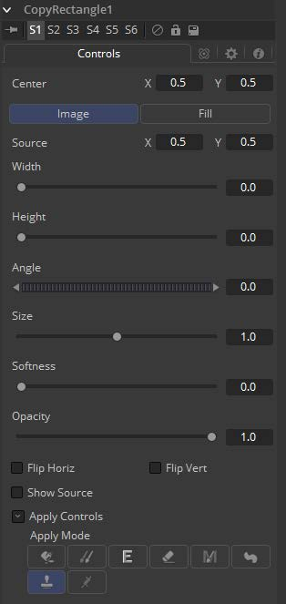

##### Center X Y 中心X Y

椭圆的中心，移动该控件来确定要拷贝内容至的位置。

##### Image 图像

要拷贝内容至目的位置的源。

##### Fill 填充

在目的位置创建填充的填充色。

##### Source Center X Y 源中心X Y

源椭圆的中心。移动该控件来确定内容拷贝自的位置。激活Show Source来显示屏幕控件。

##### Width/Height 宽度/高度

椭圆的宽度和高度，可以通过屏幕控件来修改。

##### Angle 角度

椭圆的旋转，可以通过屏幕控件来修改。

##### Size 大小

椭圆的整个大小。这是Width和Height设置的乘数。

##### Softness 柔度

椭圆边缘的柔度。

##### Opacity 不透明度

输出的整个不透明度。

##### Filp Horiz/Filp Vert 翻转水平/翻转垂直

该椭圆内的区域将会被水平和/或垂直翻转。

##### Show Source 显示源

显示屏幕控件来调整源椭圆的位置。

##### Apply Mode 应用模式

细节请参阅Paint工具的“Apply Controls 应用控件”一节。

#### **Fill 填充**

Fill至工作于Paint工具，它使用用户可定义的颜色填充一个区域。更具它工作的方式，可以与Wand 遮罩放在一起类比。它可以通过单击Paint工具的笔画菜单中的Fill按钮应用。

#### Controls 控件

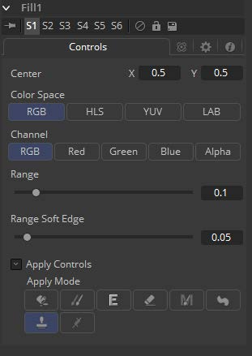

##### Selection Point 选择点

Selection Point是用于确定填充从源图像的哪个位置来派生它的图像样本。该控件在查看器中也显示为十字准线。选择点可以收到定位，亦可连接到Tracker、Path或其他表达式。

##### Color Space 色彩空间

Color Space按钮组确定了为遮罩选择源颜色时使用的色彩空间。Fill可以在RGB、YUV、HLS或LAB色彩空间下运算。

##### Channel 通道

Channel按钮组用于选择遮罩所用的颜色来自图像的所有三个色彩通道、Alpha通道或只来自一个通道。

按钮的确切标签会取决于为填充所选择的色彩空间。如果色彩空间为RGB，那么选项将为R、G或B，如果色彩空间为YUV，选项则为Y、U或V。

##### Range 范围

Range滑块控制源颜色周围会被包含来填充的色彩范围。如果值被设置为0.0，那么只有与源完全相同的颜色会被当成文件的一部分。值越高，源中越多相似的颜色会被当做要填充的整个部分。

##### Range Soft Edge 范围柔边

Range Soft Edge确定了所选颜色的衰减范围。上面定义范围中的任何像素都会被当作100%填充。如果柔边被设置为0.0，那么没有其他像素会被当成要填充的。增加柔边会增加接近但不在填充包含范围内的颜色数。这些像素将在填充中半透明。

##### Apply Mode 应用模式

细节请参阅Paint工具的“Apply Controls 应用控件”一节。

#### **Multistroke 多笔画**

Multistroke是Paint中的标准笔画。完美胜任那么一帧上百笔画的像去除跟踪标记一类的润饰绘画作业。比Stroke快很多但不支持后续的编辑。

虽然Multistroke不可直接编辑，但是可以使用PaintGroup打组，然后通过向PaintGroup添加动画来跟踪、移动或旋转来代替。或者，使用Edit Multistroke和Combine Stroke工具脚本将多笔画转换为普通的可编辑笔画，反之亦然。

可以通过单击Paint工具的笔画菜单上的Multistroke按钮来应用。

#### Controls 控件

不是所有在这里介绍的控件都会在所有模式中出现。某些控件只在特定的Paint模式中才有用处，并会在它们没有用处时隐藏。另外，一些控件也是不言自明的；Center控件的目的、Angle或Size控件也理解起来相对直白。

从简考虑，这些控件不是全部都介绍一遍。对于Controls选项卡上功能的更详细解释，请参阅本章的Working with Paint Strokes - Animating Strokes一节。

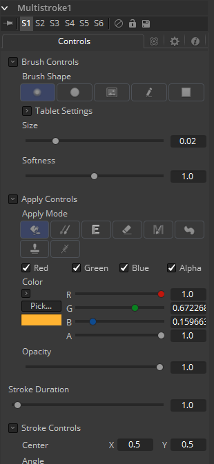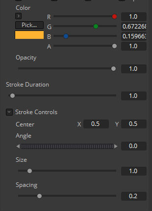

##### Brush Shape 笔刷形状

- **Soft Brush 软笔刷：**Soft Brush是一种拥有软边缘的圆形笔刷。按住Command或Ctrl键并拖动鼠标来在查看器中修改笔刷的尺寸。
- **Circular Brush 圆形笔刷：**Circular Brush是一种拥有硬边缘的笔刷形状。可以交互式地更改笔刷的尺寸。
- **Image Brush 图像笔刷：**Image Brush允许流程中或文件系统中的任何图像来用作笔刷。另见本章之后的Creating Custom Brushes。
- **Single Pixel Brush 单像素笔刷：**Single Pixel Brush可以完美胜任精细细节的工作，精准地创建尺寸为一像素的笔刷。在Single Pixel Brush上不会应用抗锯齿。
- **Square brush 方形笔刷：**Square Brush是一种拥有硬边缘的笔刷形状。

##### Vary Size 变化尺寸

- **Constant 恒定：**笔刷在整个笔画中拥有恒定的大小。
- **With Pressure 带压力：**笔画大小会随着实际施加压力的大小改变。
- **With Velocity 带速度：**笔画大小会随着绘制的速度改变。笔画越快，它就越细。

##### Vary Opacity 变化不透明度

- **Constant 恒定：**笔刷在整个笔画中拥有恒定的透明度。
- **With Pressure 带压力：**笔画透明度会随着实际施加压力的大小改变。
- **With Velocity 带速度：**笔画透明度会随着绘制的速度改变。笔画越快，它就越透明。

##### Softness 柔度

使用该控件来增加或减少软笔刷的柔度。

##### Image Source 图像源

当使用Image Source笔刷类型是，选择三种可能的源笔刷图像。

- **Tool 工具：**图像源派生自流程上工具的输出时，拖动工具到Source Tool输入来设置源。
- **Clip 片段：**图像源派生自磁盘中的图像或序列时，所有Fusion的Loader所支持的文件都可以使用。使用片段浏览器来选择原片段，使用文件名来定位文件。
- **Brush 笔刷：**存储在*Fusion>Brushes*中的图像会直接额比用作Paint工具的笔刷。在出现的菜单中选择笔刷。

#### Apply Controls 应用控件

##### Apply Mode 应用模式

- **Color 颜色：**Color应用模式简单地在屏幕上绘制着色的笔画。当与Image笔刷结合使用时，它也可以用于着色笔刷。
- **Clone 复制：**Clone应用模式拷贝图像的一部分至另一图像，或拷贝自同样的可调整位置和时间偏移的图像。任何流程中的图像都可用作源图像。
- **Emboss 浮雕：**Emboss应用模式对笔画覆盖的图像部分进行浮雕。
- **Erase 擦除：**Erase显露出被所有其他笔画覆盖的图像，会有效地擦除笔画一下的部分，实际上是销毁了这些笔画。
- **Merge 合并：**这一应用模式有效地将笔刷Merge进图像中。这一模式的行为很像Color应用模式但是没有色彩控件。该模式最适合用于Image笔刷类型。
- **Smear 涂抹：**以笔刷笔画的方向和强度为导向Smear图像。
- **Stamp 戳记：**将笔刷Stamp进图像中，完全忽略alpha通道或透明度信息。该模式最适合用于向目标图像应用印花。
- **Wire Removal 威亚擦除：**Wire Removal模式用于通过采样邻近像素并朝着笔画方向绘制来擦除线、骨骼和其他帧内的小元素。

#### Stroke Controls 笔画控件

##### Size 大小

当笔刷类型设置Soft或Circle笔刷时，该控件调整笔刷的大小。笔刷的直径在查看器中绘制为围绕鼠标指针的小圆圈。Size也可交互式地在查看器中通过按住Command或Ctrl键拖动鼠标指针调整。

##### Spacing 间距

Spacing滑块确定dab（用于沿着构成笔画或折线笔画的基础矢量形状绘制直线的样本）之间的距离。增大此滑块的值会增加笔画的密度，而减小该值很可能会使笔画看起来像虚线。

##### Stroke Animation 笔画动画

Stroke Animation菜单控件提供了多个预建的可以应用至绘画笔刷上的动画效果。该菜单只在Vector笔画时出现。

- **All Frames 所有帧：**默认显示项目的所有帧的笔画，其中Paint工具可以使用有效的目标图像。

- **Limited Duration 有限持续时间：**这只在Duration滑块指定帧数时出现。

- **Write On 写入：**选中Write On时，动画样条将添加到绘画笔画中，从而精确地复制绘画笔触的创建时间。笔画将完全按照绘制的方式写在图像上。若要调整Write On效果的时间，切换到Spline Editer（样条编辑器），然后使用Stretcher模式来调整动画样条线的总长度。若要平滑或手动调整其运动，可以尝试减少动画样条中的点。

- **Write Off 取消写入：**Write Off将执行与Write On相反的操作，从末尾开始绘制笔画，然后反过来至笔画开始处。

- **Write On Then Off 写入后取消写入：**该模式会向笔画线应用Write On，再应用Write Off。

- **Trail 尾随：**选中Trail模式将使笔触的起点和终点同时进行动画处理，彼此偏移持续时间控件中指定的量。这具有创建笔划的一部分的效果，该部分在笔划之后就像是一条路径。与Write On和Write Off的效果一样，此操作将从选择动画模式时当前的帧开始。可以使用样条（Spline）或时间线编辑器（Timeline Editer）手动调整动画的时间。

##### Duration 持续时间

Duration以帧为单位设置每个笔画的持续时间。仅在Multistroke或将笔画动画模式设置为Limited Duration时，此控件才会存在。它最常用于在场景中进行逐帧Roto。

  > **注意：**每个应用到场景的矢量笔画都会在Timeline（时间线）上有一个持续时间，并可分别地独立修剪每个笔画。持续时间可以设置为0.5，这会允许允许每个笔画只持续单个场，只在流程以Fields模式处理时。

##### Write On and Write Off 写开始和写结束

当Stroke Animation设置为Write On和Write Off方法之一时，将出现此范围滑块。该范围代表笔画的起点和终点。向上拖动低值产生删除笔画的感觉，或将高值从0.0拖动到1.0以产生在屏幕上绘制笔画的感觉。该控件可以添加动画来获得较好的效果。通过使用Stroke Animation菜单的Write On、Write off模式自动设置动画时，它会最有效地工作。

##### Make Editable 设为可编辑

该按钮只在Vector笔画时出现。单击Make Editable会将当前的笔画变成多边形样条来让图形变得可编辑或可添加动画。

#### **Paint Group 绘画组**

Paint Group只用于Paint笔画和物体。它将所有选中的绘画笔画打组在一起，来使它们可以更方便地一起处理。

Multistroke修改器同样也可以被打组，这会包含该修改器所包含的所有多笔画。通过向Paint Group添加动画，就有可能移动、跟踪和旋转一组Multistroke了。

可以通过单击Paint工具的笔画菜单上的Paint Group按钮来应用。

#### Controls 控件

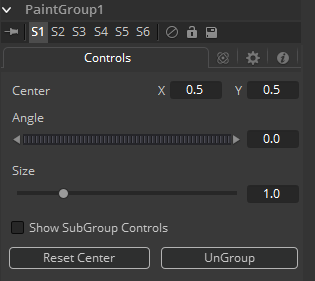

##### Center X Y 中心X Y

Group的中心。更改该控件来移动该组。

##### Angle 角度

可以通过该控件来旋转整个组。

##### Size 大小

缩放整个组。

##### Show Subgroup Controls 显示子组控件

显示组中独立笔画的控件并允许玩家修改它们。

##### Reset Center 重置中心

将Center设置为组创建时的位置。

##### Ungroup 解组

将组重新解开成独立的笔画并删除Group修改器。若是要临时打开组，则应使用Show Subgroup Controls。

#### **Polyline Stroke 多边线笔画**

Fusion提供了Polyline Stroke模式这提供了与路径或遮罩相同方式的创建并操纵笔画的能力。要向流程中添加一个多边线笔画，选择Paint工具的笔画工具栏中的Polyline按钮并在视图中点击来添加第一个点。继续点击可以向多边线添加额外的点。

注意会有一个一般的Polyline工具栏按钮会出现在查看器工具栏中。Polyline笔画默认以Click Append模式创建，它们也可以使用Draw Append模式创建。

#### Controls 控件

不是所有在这里介绍的控件都会在所有模式中出现。某些控件只在特定的Paint模式中才有用处，并会在它们没有用处时隐藏。另外，一些控件也是不言自明的；Center控件的目的、Angle或Size控件也理解起来相对直白。

从简考虑，这些控件不是全部都介绍一遍。对于Controls选项卡上功能的更详细解释，请参阅本章的Working with Paint Strokes - Animating Strokes一节。

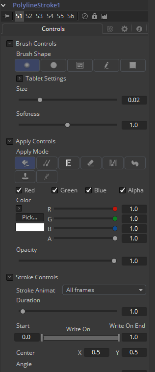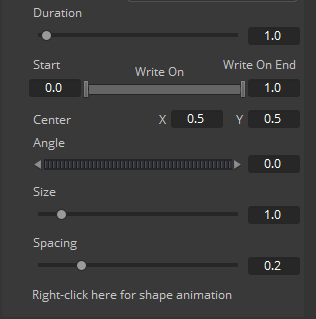

##### Brush Shape 笔刷形状

- **Soft Brush 软笔刷：**Soft Brush是一种拥有软边缘的圆形笔刷。按住Command或Ctrl键并拖动鼠标来在查看器中修改笔刷的尺寸。
- **Circular Brush 圆形笔刷：**Circular Brush是一种拥有硬边缘的笔刷形状。可以交互式地更改笔刷的尺寸。
- **Image Brush 图像笔刷：**Image Brush允许流程中或文件系统中的任何图像来用作笔刷。另见本章之后的Creating Custom Brushes。
- **Single Pixel Brush 单像素笔刷：**Single Pixel Brush可以完美胜任精细细节的工作，精准地创建尺寸为一像素的笔刷。在Single Pixel Brush上不会应用抗锯齿。
- **Square brush 方形笔刷：**Square Brush是一种拥有硬边缘的笔刷形状。

##### Vary Size 变化尺寸

- **Constant 恒定：**笔刷在整个笔画中拥有恒定的大小。
- **With Pressure 带压力：**笔画大小会随着实际施加压力的大小改变。
- **With Velocity 带速度：**笔画大小会随着绘制的速度改变。笔画越快，它就越细。

##### Vary Opacity 变化不透明度

- **Constant 恒定：**笔刷在整个笔画中拥有恒定的透明度。
- **With Pressure 带压力：**笔画透明度会随着实际施加压力的大小改变。
- **With Velocity 带速度：**笔画透明度会随着绘制的速度改变。笔画越快，它就越透明。

##### Softness 柔度

使用该控件来增加或减少软笔刷的柔度。

##### Image Source 图像源

当使用Image Source笔刷类型是，选择三种可能的源笔刷图像。

- **Tool 工具：**图像源派生自流程上工具的输出时，拖动工具到Source Tool输入来设置源。
- **Clip 片段：**图像源派生自磁盘中的图像或序列时，所有Fusion的Loader所支持的文件都可以使用。使用片段浏览器来选择原片段，使用文件名来定位文件。
- **Brush 笔刷：**存储在*Fusion>Brushes*中的图像会直接额比用作Paint工具的笔刷。在出现的菜单中选择笔刷。

#### Apply Controls 应用控件

##### Apply Mode 应用模式

- **Color 颜色：**Color应用模式简单地在屏幕上绘制着色的笔画。当与Image笔刷结合使用时，它也可以用于着色笔刷。
- **Clone 复制：**Clone应用模式拷贝图像的一部分至另一图像，或拷贝自同样的可调整位置和时间偏移的图像。任何流程中的图像都可用作源图像。
- **Emboss 浮雕：**Emboss应用模式对笔画覆盖的图像部分进行浮雕。
- **Erase 擦除：**Erase显露出被所有其他笔画覆盖的图像，会有效地擦除笔画一下的部分，实际上是销毁了这些笔画。
- **Merge 合并：**这一应用模式有效地将笔刷Merge进图像中。这一模式的行为很像Color应用模式但是没有色彩控件。该模式最适合用于Image笔刷类型。
- **Smear 涂抹：**以笔刷笔画的方向和强度为导向Smear图像。
- **Stamp 戳记：**将笔刷Stamp进图像中，完全忽略alpha通道或透明度信息。该模式最适合用于向目标图像应用印花。
- **Wire Removal 威亚擦除：**Wire Removal模式用于通过采样邻近像素并朝着笔画方向绘制来擦除线、骨骼和其他帧内的小元素。

#### Stroke Controls 笔画控件

##### Size 大小

当笔刷类型设置Soft或Circle笔刷时，该控件调整笔刷的大小。笔刷的直径在查看器中绘制为围绕鼠标指针的小圆圈。Size也可交互式地在查看器中通过按住Command或Ctrl键拖动鼠标指针调整。

##### Spacing 间距

Spacing滑块确定dab（用于沿着构成笔画或折线笔画的基础矢量形状绘制直线的样本）之间的距离。增大此滑块的值会增加笔画的密度，而减小该值很可能会使笔画看起来像虚线。

##### Stroke Animation 笔画动画

Stroke Animation菜单控件提供了多个预建的可以应用至绘画笔刷上的动画效果。该菜单只在Vector笔画时出现。

- **All Frames 所有帧：**默认显示项目的所有帧的笔画，其中Paint工具可以使用有效的目标图像。

- **Limited Duration 有限持续时间：**这只在Duration滑块指定帧数时出现。

- **Write On 写入：**选中Write On时，动画样条将添加到绘画笔画中，从而精确地复制绘画笔触的创建时间。笔画将完全按照绘制的方式写在图像上。若要调整Write On效果的时间，切换到Spline Editer（样条编辑器），然后使用Stretcher模式来调整动画样条线的总长度。若要平滑或手动调整其运动，可以尝试减少动画样条中的点。

- **Write Off 取消写入：**Write Off将执行与Write On相反的操作，从末尾开始绘制笔画，然后反过来至笔画开始处。

- **Write On Then Off 写入后取消写入：**该模式会向笔画线应用Write On，再应用Write Off。

- **Trail 尾随：**选中Trail模式将使笔触的起点和终点同时进行动画处理，彼此偏移持续时间控件中指定的量。这具有创建笔划的一部分的效果，该部分在笔划之后就像是一条路径。与Write On和Write Off的效果一样，此操作将从选择动画模式时当前的帧开始。可以使用样条（Spline）或时间线编辑器（Timeline Editer）手动调整动画的时间。

##### Duration 持续时间

Duration以帧为单位设置每个笔画的持续时间。仅在Multistroke或将笔画动画模式设置为Limited Duration时，此控件才会存在。它最常用于在场景中进行逐帧Roto。

  > **注意：**每个应用到场景的矢量笔画都会在Timeline（时间线）上有一个持续时间，并可分别地独立修剪每个笔画。持续时间可以设置为0.5，这会允许允许每个笔画只持续单个场，只在流程以Fields模式处理时。

##### Write On and Write Off 写开始和写结束

当Stroke Animation设置为Write On和Write Off方法之一时，将出现此范围滑块。该范围代表笔画的起点和终点。向上拖动低值产生删除笔画的感觉，或将高值从0.0拖动到1.0以产生在屏幕上绘制笔画的感觉。该控件可以添加动画来获得较好的效果。通过使用Stroke Animation菜单的Write On、Write off模式自动设置动画时，它会最有效地工作。

##### Make Editable 设为可编辑

该按钮只在Vector笔画时出现。单击Make Editable会将当前的笔画变成多边形样条来让图形变得可编辑或可添加动画。

##### Right Click Here for Shape Animation 右键单击此处来添加形状动画

要像Polyline Mask一样像Polyline形状添加动画的话，右键该控件，选择animate。

#### **Stroke 笔画**

Paint工具第一次被添加到流程中时，笔刷类型会被设置为白色Color应用模式的中等大小圆形软笔刷。

释放鼠标按钮以结束笔画的创建。要绘制另一个笔画，只需再次单击并继续。新笔画会使用与上次应用的笔画相同的设置添加到图像。绘画完成后，在Paint工具栏中选择Select按钮，以避免意外添加新笔触。

在Brush或Polyline模式下，Tool选项卡中显示的控件会影响下一个创建的笔触，而不影响已经创建的笔触。要调整现有笔画的设置，请使用Paint工具栏切换到Select模式，然后选择笔画。

要将笔画添加到流程中，请从Paint工具的Stroke工具栏中选择Polyline按钮，将鼠标或笔放在图像上，单击并按住鼠标左键开始绘制。

#### Controls 控件

不是所有在这里介绍的控件都会在所有模式中出现。某些控件只在特定的Paint模式中才有用处，并会在它们没有用处时隐藏。另外，一些控件也是不言自明的；Center控件的目的、Angle或Size控件也理解起来相对直白。

从简考虑，这些控件不是全部都介绍一遍。对于Controls选项卡上功能的更详细解释，请参阅本章的Working with Paint Strokes - Animating Strokes一节。

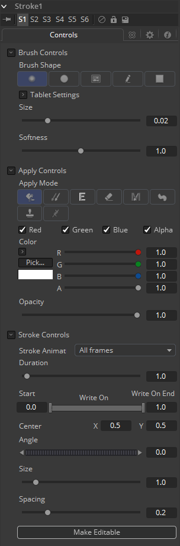

##### Brush Shape 笔刷形状

- **Soft Brush 软笔刷：**Soft Brush是一种拥有软边缘的圆形笔刷。按住Command或Ctrl键并拖动鼠标来在查看器中修改笔刷的尺寸。
- **Circular Brush 圆形笔刷：**Circular Brush是一种拥有硬边缘的笔刷形状。可以交互式地更改笔刷的尺寸。
- **Image Brush 图像笔刷：**Image Brush允许流程中或文件系统中的任何图像来用作笔刷。另见本章之后的Creating Custom Brushes。
- **Single Pixel Brush 单像素笔刷：**Single Pixel Brush可以完美胜任精细细节的工作，精准地创建尺寸为一像素的笔刷。在Single Pixel Brush上不会应用抗锯齿。
- **Square brush 方形笔刷：**Square Brush是一种拥有硬边缘的笔刷形状。

##### Vary Size 变化尺寸

- **Constant 恒定：**笔刷在整个笔画中拥有恒定的大小。
- **With Pressure 带压力：**笔画大小会随着实际施加压力的大小改变。
- **With Velocity 带速度：**笔画大小会随着绘制的速度改变。笔画越快，它就越细。

##### Vary Opacity 变化不透明度

- **Constant 恒定：**笔刷在整个笔画中拥有恒定的透明度。
- **With Pressure 带压力：**笔画透明度会随着实际施加压力的大小改变。
- **With Velocity 带速度：**笔画透明度会随着绘制的速度改变。笔画越快，它就越透明。

##### Softness 柔度

使用该控件来增加或减少软笔刷的柔度。

##### Image Source 图像源

当使用Image Source笔刷类型是，选择三种可能的源笔刷图像。

- **Tool 工具：**图像源派生自流程上工具的输出时，拖动工具到Source Tool输入来设置源。
- **Clip 片段：**图像源派生自磁盘中的图像或序列时，所有Fusion的Loader所支持的文件都可以使用。使用片段浏览器来选择原片段，使用文件名来定位文件。
- **Brush 笔刷：**存储在*Fusion>Brushes*中的图像会直接额比用作Paint工具的笔刷。在出现的菜单中选择笔刷。

#### Apply Controls 应用控件

##### Apply Mode 应用模式

- **Color 颜色：**Color应用模式简单地在屏幕上绘制着色的笔画。当与Image笔刷结合使用时，它也可以用于着色笔刷。
- **Clone 复制：**Clone应用模式拷贝图像的一部分至另一图像，或拷贝自同样的可调整位置和时间偏移的图像。任何流程中的图像都可用作源图像。
- **Emboss 浮雕：**Emboss应用模式对笔画覆盖的图像部分进行浮雕。
- **Erase 擦除：**Erase显露出被所有其他笔画覆盖的图像，会有效地擦除笔画一下的部分，实际上是销毁了这些笔画。
- **Merge 合并：**这一应用模式有效地将笔刷Merge进图像中。这一模式的行为很像Color应用模式但是没有色彩控件。该模式最适合用于Image笔刷类型。
- **Smear 涂抹：**以笔刷笔画的方向和强度为导向Smear图像。
- **Stamp 戳记：**将笔刷Stamp进图像中，完全忽略alpha通道或透明度信息。该模式最适合用于向目标图像应用印花。
- **Wire Removal 威亚擦除：**Wire Removal模式用于通过采样邻近像素并朝着笔画方向绘制来擦除线、骨骼和其他帧内的小元素。

#### Stroke Controls 笔画控件

##### Size 大小

当笔刷类型设置Soft或Circle笔刷时，该控件调整笔刷的大小。笔刷的直径在查看器中绘制为围绕鼠标指针的小圆圈。Size也可交互式地在查看器中通过按住Command或Ctrl键拖动鼠标指针调整。

##### Spacing 间距

Spacing滑块确定dab（用于沿着构成笔画或折线笔画的基础矢量形状绘制直线的样本）之间的距离。增大此滑块的值会增加笔画的密度，而减小该值很可能会使笔画看起来像虚线。

##### Stroke Animation 笔画动画

Stroke Animation菜单控件提供了多个预建的可以应用至绘画笔刷上的动画效果。该菜单只在Vector笔画时出现。

- **All Frames 所有帧：**默认显示项目的所有帧的笔画，其中Paint工具可以使用有效的目标图像。

- **Limited Duration 有限持续时间：**这只在Duration滑块指定帧数时出现。

- **Write On 写入：**选中Write On时，动画样条将添加到绘画笔画中，从而精确地复制绘画笔触的创建时间。笔画将完全按照绘制的方式写在图像上。若要调整Write On效果的时间，切换到Spline Editer（样条编辑器），然后使用Stretcher模式来调整动画样条线的总长度。若要平滑或手动调整其运动，可以尝试减少动画样条中的点。

- **Write Off 取消写入：**Write Off将执行与Write On相反的操作，从末尾开始绘制笔画，然后反过来至笔画开始处。

- **Write On Then Off 写入后取消写入：**该模式会向笔画线应用Write On，再应用Write Off。

- **Trail 尾随：**选中Trail模式将使笔触的起点和终点同时进行动画处理，彼此偏移持续时间控件中指定的量。这具有创建笔划的一部分的效果，该部分在笔划之后就像是一条路径。与Write On和Write Off的效果一样，此操作将从选择动画模式时当前的帧开始。可以使用样条（Spline）或时间线编辑器（Timeline Editer）手动调整动画的时间。

##### Duration 持续时间

Duration以帧为单位设置每个笔画的持续时间。仅在Multistroke或将笔画动画模式设置为Limited Duration时，此控件才会存在。它最常用于在场景中进行逐帧Roto。

  > **注意：**每个应用到场景的矢量笔画都会在Timeline（时间线）上有一个持续时间，并可分别地独立修剪每个笔画。持续时间可以设置为0.5，这会允许允许每个笔画只持续单个场，只在流程以Fields模式处理时。

##### Write On and Write Off 写开始和写结束

当Stroke Animation设置为Write On和Write Off方法之一时，将出现此范围滑块。该范围代表笔画的起点和终点。向上拖动低值产生删除笔画的感觉，或将高值从0.0拖动到1.0以产生在屏幕上绘制笔画的感觉。该控件可以添加动画来获得较好的效果。通过使用Stroke Animation菜单的Write On、Write off模式自动设置动画时，它会最有效地工作。

##### Make Editable 设为可编辑

该按钮只在Vector笔画时出现。单击Make Editable会将当前的笔画变成多边形样条来让图形变得可编辑或可添加动画。

##### Right Click Here for Shape Animation 右键单击此处来添加形状动画

要像Polyline Mask一样像Polyline形状添加动画的话，右键该控件，选择animate。