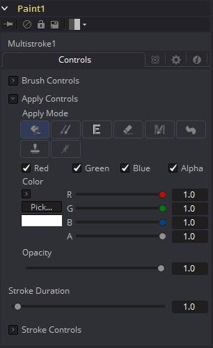
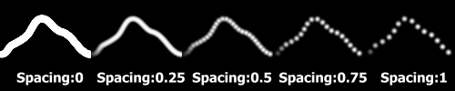
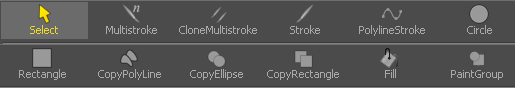
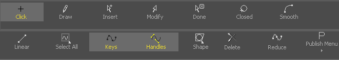

### Paint [Pnt] 绘画

Paint是一个极其灵活、基于笔画、用于直接对一系列图像做出更改的系统。使用Paint工具可以进行线和谷歌的移除、图像拷贝、或迅速创作自定义遮罩和蒙版。

Fusion的Paint甚至可以用来从头创作新的图像或艺术元素。

每一个Paint工具都是由一系列笔刷笔画组成的。这些笔画是直接在视图中显示的矢量图形。使用的笔刷类型、笔画的尺寸和图像上笔画的效果都是用户可控制的。可以使用大范围的应用模式和笔刷类型。

笔刷笔画可以变为可编辑的样条来进行更精细的控制。它们也可以添加动画来随时间改变形状、长度和尺寸。不透明度和笔画尺寸会受到速度和压力（如果数位板支持的话）的影响。

无限制的撤销和重做操作提供了向图像序列提交更改之前进行试验的能力。Paint笔画也可以进行重排、删除和修改，它有着无限的灵活性。

#### Controls 控件

不是所有在这里介绍的控件都会在所有模式中出现。某些控件只在特定的Paint模式中才有用处，并会在它们没有用处时隐藏。另外，一些控件也是不言自明的；Center控件的目的、Angle或Size控件也理解起来相对直白。

从简考虑，这些控件不是全部都介绍一遍。对于Controls选项卡上功能的更详细解释，请参阅本章的Working with Paint Strokes - Animating Strokes一节。

##### Color Space 色彩空间

色彩空间按钮组旨在当前模式设置为Fill时才可见。它们用于在采样填充中心周围的颜色来包括填充范围时选择色彩空间。

##### R, G, B and Alpha R、G、B和Alpha

选中后，这些复选框反映了要绘制的颜色通道。举个例子，关闭R、G、B而开启Alpha后，绘制只会出现在Alpha通道上。

#### Brush Controls 笔刷控件

##### Brush Shape 笔刷形状

- **Soft Brush 软笔刷：**Soft Brush是一种拥有软边缘的圆形笔刷。按住Command或Ctrl键并拖动鼠标来在查看器中修改笔刷的尺寸。
- **Circular Brush 圆形笔刷：**Circular Brush是一种拥有硬边缘的笔刷形状。可以交互式地更改笔刷的尺寸。
- **Image Brush 图像笔刷：**Image Brush允许流程中或文件系统中的任何图像来用作笔刷。另见本章之后的Creating Custom Brushes。
- **Single Pixel Brush 单像素笔刷：**Single Pixel Brush可以完美胜任精细细节的工作，精准地创建尺寸为一像素的笔刷。在Single Pixel Brush上不会应用抗锯齿。
- **Square brush 方形笔刷：**Square Brush是一种拥有硬边缘的笔刷形状。

##### Vary Size 变化尺寸

- **Constant 恒定：**笔刷在整个笔画中拥有恒定的大小。
- **With Pressure 带压力：**笔画大小会随着实际施加压力的大小改变。
- **With Velocity 带速度：**笔画大小会随着绘制的速度改变。笔画越快，它就越细。

##### Vary Opacity 变化不透明度

- **Constant 恒定：**笔刷在整个笔画中拥有恒定的透明度。
- **With Pressure 带压力：**笔画透明度会随着实际施加压力的大小改变。
- **With Velocity 带速度：**笔画透明度会随着绘制的速度改变。笔画越快，它就越透明。

##### Softness 柔度

使用该控件来增加或减少软笔刷的柔度。

##### Image Source 图像源

当使用Image Source笔刷类型是，选择三种可能的源笔刷图像。

- **Tool 工具：**图像源派生自流程上工具的输出时，拖动工具到Source Tool输入来设置源。
- **Clip 片段：**图像源派生自磁盘中的图像或序列时，所有Fusion的Loader所支持的文件都可以使用。使用片段浏览器来选择原片段，使用文件名来定位文件。
- **Brush 笔刷：**存储在*Fusion>Brushes*中的图像会直接额比用作Paint工具的笔刷。在出现的菜单中选择笔刷。

#### Apply Controls 应用控件

##### Apply Mode 应用模式

- **Color 颜色：**Color应用模式简单地在屏幕上绘制着色的笔画。当与Image笔刷结合使用时，它也可以用于着色笔刷。
- **Clone 复制：**Clone应用模式拷贝图像的一部分至另一图像，或拷贝自同样的可调整位置和时间偏移的图像。任何流程中的图像都可用作源图像。
- **Emboss 浮雕：**Emboss应用模式对笔画覆盖的图像部分进行浮雕。
- **Erase 擦除：**Erase显露出被所有其他笔画覆盖的图像，会有效地擦除笔画一下的部分，实际上是销毁了这些笔画。
- **Merge 合并：**这一应用模式有效地将笔刷Merge进图像中。这一模式的行为很像Color应用模式但是没有色彩控件。该模式最适合用于Image笔刷类型。
- **Smear 涂抹：**以笔刷笔画的方向和强度为导向Smear图像。
- **Stamp 戳记：**将笔刷Stamp进图像中，完全忽略alpha通道或透明度信息。该模式最适合用于向目标图像应用印花。
- **Wire Removal 威亚擦除：**Wire Removal模式用于通过采样邻近像素并朝着笔画方向绘制来擦除线、骨骼和其他帧内的小元素。

#### Stroke Controls 笔画控件

##### Size 大小

当笔刷类型设置Soft或Circle笔刷时，该控件调整笔刷的大小。笔刷的直径在查看器中绘制为围绕鼠标指针的小圆圈。Size也可交互式地在查看器中通过按住Command或Ctrl键拖动鼠标指针调整。

##### Spacing 间距

Spacing滑块确定dab（用于沿着构成笔画或折线笔画的基础矢量形状绘制直线的样本）之间的距离。增大此滑块的值会增加笔画的密度，而减小该值很可能会使笔画看起来像虚线。

##### Stroke Animation 笔画动画

Stroke Animation菜单控件提供了多个预建的可以应用至绘画笔刷上的动画效果。该菜单只在Vector笔画时出现。

- **All Frames 所有帧：**默认显示项目的所有帧的笔画，其中Paint工具可以使用有效的目标图像。

- **Limited Duration 有限持续时间：**这只在Duration滑块指定帧数时出现。

- **Write On 写入：**选中Write On时，动画样条将添加到绘画笔画中，从而精确地复制绘画笔触的创建时间。笔画将完全按照绘制的方式写在图像上。若要调整Write On效果的时间，切换到Spline Editer（样条编辑器），然后使用Stretcher模式来调整动画样条线的总长度。若要平滑或手动调整其运动，可以尝试减少动画样条中的点。

- **Write Off 取消写入：**Write Off将执行与Write On相反的操作，从末尾开始绘制笔画，然后反过来至笔画开始处。

- **Write On Then Off 写入后取消写入：**该模式会向笔画线应用Write On，再应用Write Off。

- **Trail 尾随：**选中Trail模式将使笔触的起点和终点同时进行动画处理，彼此偏移持续时间控件中指定的量。这具有创建笔划的一部分的效果，该部分在笔划之后就像是一条路径。与Write On和Write Off的效果一样，此操作将从选择动画模式时当前的帧开始。可以使用样条（Spline）或时间线编辑器（Timeline Editer）手动调整动画的时间。

##### Duration 持续时间

Duration以帧为单位设置每个笔画的持续时间。仅在Multistroke或将笔画动画模式设置为Limited Duration时，此控件才会存在。它最常用于在场景中进行逐帧Roto。

  > **注意：**每个应用到场景的矢量笔画都会在Timeline（时间线）上有一个持续时间，并可分别地独立修剪每个笔画。持续时间可以设置为0.5，这会允许允许每个笔画只持续单个场，只在流程以Fields模式处理时。

##### Write On and Write Off 写开始和写结束

当Stroke Animation设置为Write On和Write Off方法之一时，将出现此范围滑块。该范围代表笔画的起点和终点。向上拖动低值产生删除笔画的感觉，或将高值从0.0拖动到1.0以产生在屏幕上绘制笔画的感觉。该控件可以添加动画来获得较好的效果。通过使用Stroke Animation菜单的Write On、Write off模式自动设置动画时，它会最有效地工作。

##### Make Editable 设为可编辑

该按钮只在Vector笔画时出现。单击Make Editable会将当前的笔画变成多边形样条来让图形变得可编辑或可添加动画。

#### Working with Paint Stroke 使用绘画笔画工作

##### Stroke Menu 笔画菜单

要创建一个新的笔刷，你可以从视图中显示的菜单中选择你需要的笔画类型。对于更详细的解释，请参阅“Modifiers 修改器”一章的“Paint Stroke Modifiers 绘画笔画修改器”。当选择或编辑一个绘画笔画时，视图中会显示一个菜单来选择不同的编辑选项。

对于更详细的解释，请参阅“使用多边形工作 Working with Polylines”一章。

##### Types of Paint Strokes 绘画笔刷的类型

##### Circle 圆

创建一个包含可添加动画的半径和中心属性的圆形。

##### Clone Multistroke 克隆多笔画

类似于下面详细描述的Multistroke，但它专门用于将元素从一个图像克隆到另一个图像。

##### Copy Polyline 复制多边形

一个拥有可添加动画的偏移的将图片中元素克隆至另一图像的多边形区域。

##### Copy Rectangle 复制矩形

一个拥有可添加动画的偏移的将图片中元素克隆至另一图像的矩形区域。

##### Fill 填充

基于可调整的颜色值填充图像中的区域。

##### Multistroke 多笔画

完美胜任那么一帧上百笔画的像去除跟踪标记一类的润饰绘画作业。比Stroke快很多但不支持后续的编辑。

##### Paint Group 绘画组

允许轻松地打组多个笔画，并拥有完整的中心和尺寸的控制。

##### Polyline Stroke 多边线笔画

基于可添加动画的多边线的完整可编辑的笔画，可以连接至像遮罩或动画路径一类的现存的多边线。

##### Rectangle 矩形

创建一个矩形区域。

##### Stroke 笔画

“标准”笔画。完整地可添加动画和可编辑。但如果图像中使用了上百个那么会变卡；对于大量的笔刷最好还是使用Multistroke。

