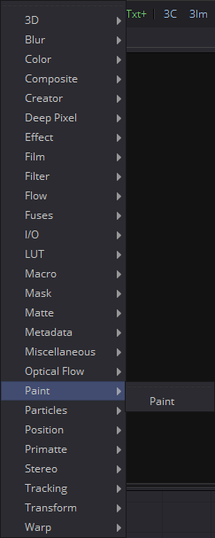
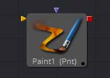

## 第二十三章 Paint Tools 绘画工具

- [Paint [Pnt] 绘画](./Paint%20[Pnt].md)
- [Hot Keys 热键](./Hot%20Keys.md)
- [Modifiers 修改器](./Paint%20Modifiers.md)
  - Circle 圆
  - Clone Multistroke 克隆多笔画
  - Copy Ellipse 复制椭圆
  - Copy Polyline 复制多边线
  - Copy Rectangle 复制矩形
  - Fill 填充
  - Multistroke 多笔画
  - Paint Group 绘画组
  - Polyline Stroke 多边线笔画

<table id="img">
  <tr>
    <td></td>
    <td></td>
  </tr>
</table>