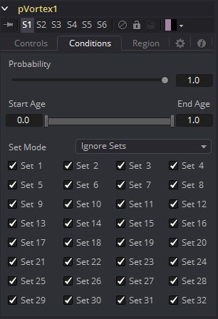
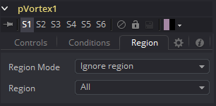
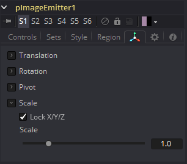
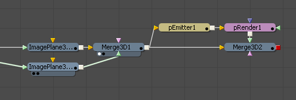
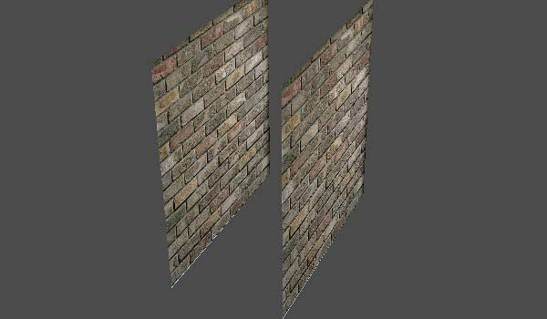
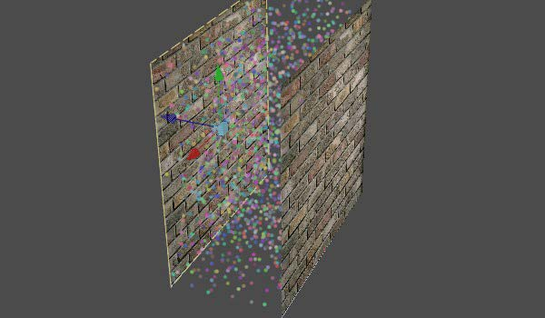
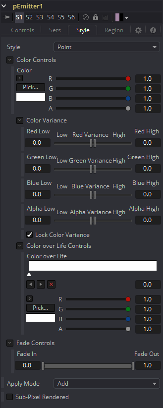
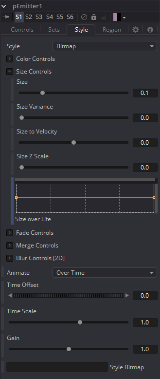

### Particle Common Controls 粒子通用控件

通用控制可以在Fusion的每个粒子工具里找到。

#### Conditions tab 条件选项卡

##### Probability 概率

决定该工具影响任何指定粒子的概率或百分比的机会。

默认1.0数值将影响所有的粒子。设置0.6将意味着每个粒子有60%的机会被影响。

概率是通过每一帧的每个粒子来计算。例如：一个粒子在第一帧不受力的影响，在下一帧同样概率不被影响。

##### Start/End Age 起始 / 结束的年龄

此范围控制用于约束该工具对指定粒子寿命百分比的效果。 

例如：约束粒子生命最后20%的效果，设置起始数值为0.8，结束数值保持在1.0。按100帧寿命来算，此工具只影响80到100的粒子。

##### Set Mode and Sets 组的方式和组群

此菜单控制决定粒子工具的效果将被应用于所有粒子，仅限于指定粒子组群，或应用于除已选择的组群外所有粒子。

集合由创建粒子的工具指定：pEmitter、pImageEmitter、pChangeStyle和pSpawn工具。

#### Region Tab 区域选项卡

##### Region 区域

区域用于将工具的效果限制于几何区域或平面，并确定在pEmitter工具的哪里来创建粒子的区域。有七种类型的区域，每个区域都有自己的控制。

- **All 全部：**在2D中，粒子将被创建在图像边界内的任何位置。在3D中，这个区域成了1.0 x 1.0 x  1.0单位大小的立方体。

- **Bezier 贝塞尔：**Bezier模式使用用户创建的多边形线段来确定创建粒子的区域。Bezier模式在2D和3D模式下都适用，但是贝塞尔多边形线段区域只能在2D模式下创建。

  若要随时间设置多边形线的动画或将此线段连接到另一条多边形线段上，请在控制的底部多边形线的标签上单击鼠标右键，然后从右键菜单中选择相应的选项。 

- **Bitmap 位图：**合成中其他工具之一的位图源将用作粒子生成的区域。

- **Cube 立方：**完整的3D立方体用于确定在其中创建粒子的区域。高度、宽度、深度和XYZ位置都可以由用户决定，并随时间设置动画。

- **Line 线：**一条简易的线条控制决定了粒子的创建位置。这条线由两个端点组成，可以根据需要连接到路径或跟踪器上。与Bezier一样，该区域类型在3D中工作，但线的本身只能在2D中创建和调整。

- **Mesh 网格：**自Fusion  6.1以来，任意3D网格都可以用作区域。在网格模式下，也可以使用对象ID滑块通过对象ID限制该区域。有关网格区域如何工作的详细说明，请参见下文。

- **Rectangle 矩形：**矩形区域类型与立方体类型类似，只是此区域在Z空间中没有深度。与其他2D发射器区域不同，此区域可以在Z轴空间中定位和旋转。

- **Sphere (3D) 球体（3D）：**这是一个具备大小和Z轴中心控制的球形3D发射器区域。Sphere(3D)是pEmitter工具的默认区域类型。

##### Start/End X,Y,Z  Offset 起始/结束XYZ偏移

（仅限Line模式）这些控制定义3D空间中直线的起点和终点。

#### Mesh Regions 网格区域

##### Region Type 区域类型

区域类型控制允许艺术家选择该区域是否包含内部体积，

或者只是表面。例如，当网格区域与pEmitter一起使用时，此控制将确定粒子是从表面发射还是从整个体积发射。

##### Winding Rule and Winding Ray Direction 绕线规则和绕线方向

绕线规则和绕线方向控制确定网格区域将如何处理

未完全闭合的网格创建粒子，这在许多从外部应用程序导入的网格中很常见。

这种情况在导入的网格几何体中很常见，即使是显示为闭合的几何体，

由于顶点焊接不当，也会经常出现“泄漏”。

为了确定一个粒子是否在一个物体的内部，光线从无穷远投射到这个粒子，

然后再投射到无穷远。绕线的方向决定了该光线投射的方向。

每次一个曲面被光线穿透时，它都会被记录下来并添加到总数中以生成一个绕线数。

与曲面相反的法线计数为+1，与法线计数为-1。

然后使用绕线规则确定内部/外部的内容。例如，将“绕线规则”设置为“奇数”意味着在创建粒子时只保留绕线数值为奇数的粒子。

使用完全相同的方法来确保与其相交的多边形线正确闭合。

例如，下面的流程和图像显示两个图像平面用作粒子创建的网格区域。

通过将区域绕线方向设置为Z（蓝色）轴，可以将该网格视为闭合体积，以便创建粒子，如下图所示。

##### Limit By ObjectID,  ObjectID

选中此复选框允许艺术家使用复选框下方的滑块来过滤场景几何体，以便只使用具备匹配对象ID属性的几何体作为区域的一部分。

此菜单控制确定粒子工具的效果是应用于所有粒子、仅限于来自指定集的粒子，还是应用于除选定集之外的所有粒子。

集由实际创建粒子的工具指定。这些是pEmitter、pImageEmitter、pChangeStyle和pSpawn工具。

#### Style Tab 样式选项卡

“样式”标签出现在Particle Emitter, Particle Spawn, Particle ChangeStyle 和 Particle Image Emitter中。在“样式”标签中，确定粒子的类型和外观。

“样式”标签提供了影响粒子外观的控制，从而可以按时间变化确定粒子的外观并设置动画。

##### Style Type 样式类型

“样式菜单”控制提供对“粒子套件”支持各种类型的粒子访问。每种样式都有自己的特定控制，以及将与其他样式共享的控制。

- **Point 点：**此选项产生的粒子大小正好是一个像素。点样式特有的控制是“应用模式”和“渲染子像素”。
- **Bitmap and Brush 位图和画笔：**位图样式和画笔样式都会根据图像文件生成粒子。位图样式依赖于流程中另一个工具的图像，画笔样式使用画笔目录中的图像文件。它们都有许多用于影响其外观和动画的控制，如下所述。
- **Blob 斑点：**此选项可产生大而柔和的球形粒子，并具有“颜色”，“大小”，“淡入时间”，“合并”方式和“杂色”控制。
- **Line 线：**这种样式产生带有可选“衰减”的直线类型粒子。下文描述的“大小转换为速度”控制（在“大小控制”下）对于此线型通常很有用。淡入淡出控制可调整线条长度上的衰减量。
- **Point Cluster 点簇：**这种样式产生一小簇单个像素粒子。点簇类似于点样式，但是当需要大量粒子时它们会更高效。该样式与点样式共享控制。点簇样式特定的其他控制是“点的数量”和“数量变化”。

##### Color 颜色

该标准颜色控制选择由发射器生成的粒子的颜色和alpha值。

##### Color Variance 颜色变化

这些范围控制提供了一种扩展pEmitter产生颜色的方法。将红色变化范围设置为-0.2到+0.2将在红色通道的任意一侧产生20％的颜色变化，总变化为40％。如果将pEmitter设置为产生R0.5，G0.5，B0.5（纯灰色），则上面显示的变化将在R0.3，G0.5，B0.5和R0.7，G0.5，B0.5之间的点产生颜色范围。

要将颜色空间显示为介于0-256或0-65535之间的值，请使用“首选项”对话框的“常规”标签中提供的“显示颜色为”选项来更改Fusion使用的值。

##### Lock Color Variance 锁定颜色变化

此复选框锁定粒子的颜色变化。解锁后，此选项可以将颜色变化以不同方式应用于每个颜色通道，从而产生更大范围的颜色。

##### Color Over Life 颜色生命周期

这种标准的渐变控制允许选择一系列的颜色值，这些值将在粒子的整个生命周期内保持不变。

渐变左侧的点表示粒子出生时的颜色。右边的点显示了粒子寿命结束时的颜色。

可以将其他点添加到渐变控制中，以使粒子颜色在其整个生命周期内发生变化。

这种类型的控制对于火焰效果非常有用（例如，火焰可能开始为蓝色，变为橙色并在最后变成深红色）。通过在控制上单击鼠标右键，然后从右键菜单中选择“动画”，可以对渐变本身进行动画处理。渐变上所有的点都将由一个“生命周期内的颜色”样条线控制，该样条线控制渐变本身的变化速度。您也可以使用“来自图像” 修改器，该修改器从图像中的颜色范围根据两点之间的直线生成渐变。

##### Size Controls 大小控件

大多数大小控制是一目了然的。“大小”和“大小变化”控制用于确定每个粒子的大小和大小变化程度。值得注意的是，Point样式没有大小控制（每个点的大小均为单个像素，没有其他控制）。

当使用“位图粒子”样式时，值1.0表示每个粒子应与输入位图的大小完全相同。值为2.0会将粒子按比例放大200％。为了获得最佳质量的粒子，请尝试使输入位图与系统生成的最大粒子一样大或更大。

对于点簇样式，大小控制可调整簇的密度，或者是调整每个粒子之间的距离。

还有其他大小控制，可用于根据速度和深度进一步调整粒子的大小。

##### Size to Velocity 速度大小

相对于粒子的速度或速率，这会增加每个粒子的大小。粒子的速度将添加到该大小中，并通过此控制的值进行缩放。

此控制上的1.0（例如，以0.1速度传输的粒子）将为大小增加0.1  (velocity * sizetovelocity + size =  newsize)。这对于线条样式最有用，但是该控制可用于调整任意样式的大小。

##### Size Z Scale Z大小比例

该控制根据每个粒子的深度（在Z轴空间中的位置）测量其大小增加或减少的程度。其效果是放大或减少透视的影响。默认值为1.0，这提供了相对真实的透视效果。

焦平面上的对象（Z =  0.0）将为实际调整大小。沿Z方向更远的对象将变小。沿Z轴靠近的对象将变大。

值为2.0会明显放大效果，而值为0.0将完全消除透视效果。

##### Size Over Life 大小生命周期

此LUT样条线控制确定了粒子在其整个生命周期中的大小。纵向比例表示大小控制定义的值的百分比，范围是0到200％。水平比例表示粒子寿命的百分比（0到100％）。

该图表支持标准LUT editor（LUT编辑器）可用的所有功能。这些功能可以通过右键单击图形来访问。也可以在较大的Spline view（样条线视图）中查看和编辑图形样条线。

##### Fade Controls 淡化控制

这个简单的范围滑块提供了一种可以在粒子生命周期的开始和结束时使其淡化的机制。增大“淡入”值将导致粒子在其寿命开始时淡入。减小“淡出”值将导致粒子在其寿命结束时淡出。

此控制的值表示粒子总寿命的百分比，因此，将“淡入”设置为0.1会导致粒子在其总寿命的前10％内淡入。例如，寿命为100帧的粒子将从第0..10帧淡入。

##### Merge Controls 合并控制

这组粒子控制会影响单个粒子合并在一起的方式。减法/加法滑块的工作原理与标准的“合并”工具中的文档完全相同。当粒子合并在一起时，“烧入”控制将导致粒子过度曝光或“blow  out”。

合并控制都不会对3D粒子系统产生任何影响。

##### Blur Controls 模糊控制

这组粒子控制可用于将模糊应用于单个粒子。模糊可以按年龄或Z深度位置全局应用。

所有模糊控制都不会对3D粒子系统产生任何影响。

##### Blur and Blur Variance 模糊和模糊变化

这些控制将模糊应用于每个粒子。与pRender工具中的“模糊”不同，在将粒子合并到一起之前，此选项将独立应用于每个粒子。“模糊变化”滑块可修改应用于每个粒子的模糊数量。

##### Blur Over Life 模糊生命周期

此样条线图表控制在粒子整个生命周期内应用于其模糊数量。纵向比例表示模糊控制定义的值的百分比。横向比例表示粒子寿命的百分比。

该图表支持标准LUT编辑器可用的所有功能。这些功能可以通过右键单击图形来访问。也可以在较大的样条线视图中查看和编辑图形样条线。

##### Z Blur (DoF) and DoF Focus Z模糊(DoF)和 DoF焦点

此滑块控制基于每个粒子沿Z轴上的位置对其应用模糊。

DoF焦点范围控制用于确定图像的哪些区域保持聚焦。沿Z轴较低的值更接近摄像机。越高的值距离越远。范围内的粒子将保持聚焦。超出该范围的粒子将应用“Z模糊”控制定义的模糊。

##### Apply Mode

- **Add 添加：**通过将每个粒子的颜色值相加来组合重叠的粒子。
- **Merge 合并：**重叠的粒子合并在一起。

##### Style Bitmap 位图样式

（仅限位图样式）选择“位图”样式以及流程视图中工具图标上的橙色“位图样式”输入时，将显示此控制。将2D工具连接到此输入，以提供用于粒子的图像。您可以在流程视图上执行此操作，也可以将图像源工具从“流程视图”或“时间线视图”拖放到“位图样式”控制上，或者右键单击该控制，然后从“连接到”菜单中选择所需的源。

##### Brush 画笔

（仅限画笔样式）此下拉列表显示存储在“画笔”目录中的所有图像文件的名称。画笔目录的位置在Preferences（首选项）对话框的Path Maps（路径映射）下定义。默认值为Fusion的安装文件夹中的画笔子目录。如果此目录中没有图像，则菜单中只有唯一的选项，显示“无”，并且不会渲染任何粒子。

##### Animate 动画

（仅限位图样式）此列表确定如何将位图源的动画应用于新创建的粒子。在实验进行之前，很难直观地看到此控制的影响。一个好的实验方法是在  Fusion>Examples  目录中，加载名为pTextParticleAge.comp到流程视图中，并尝试这三种设置。在显示视图中查看Text（文本）工具，在另一个视图中查看pRender工具，然后使用 [ 和 ]  快捷键逐帧浏览帧。

##### Over Time 随着时间的推移

所有粒子都使用当前时间由“位图样式”工具生成的图像，并随着时间的增加而逐步更改为每个连续的图像。在第1帧的地方创建的粒子将包含“位图样式”第1帧的图像。在第2帧的地方，原始粒子将使用第2帧中的图像，所有新粒子也将使用。所有创建的粒子将始终共享来自其源素材完全相同的位图图像。

##### Particle Age 粒子年龄

每个粒子独立于其他粒子，都通过“位图样式”工具提供的图像序列进行动画处理。换句话说，单个粒子的外观是从“位图样式”工具中连续获取的，并根据其年龄进行索引。

##### Particle Birth Time 粒子出生时间

新粒子在当前时间从“位图样式”工具中获取图像，并保持其不变，直到粒子寿命结束。因此，在指定帧上生成的粒子将全部具有相同的外观，并保持这种状态。

##### Time Offset 时间偏移

（仅限位图样式）此控制允许位图源帧及时从当前帧偏移。

##### Time Scale 时间比例

（仅限位图样式）此控制可用于按比例缩放源位图图像的时间范围。例如，比例为2将导致从第2帧的位图源读取在第1帧的地方创建粒子。

##### Gain 增益

（仅限位图和画笔样式）此控制用于对用作位图的图像总体增益应用校正。较高的值会产生较亮的图像，而较低的值会同时降低图像的亮度和透明度。

##### Noise 噪波

（仅限Blob样式）增大此控制的值将向Blob粒子引入颗粒类型的噪波。

##### Fade 淡化

（仅限线条样式）“淡入淡出”控制可调整线条粒子长度上的衰减。默认值1.0会导致线条在长度的末端完全淡出。

##### Sub Pixel Rendered 子像素渲染

（仅限点和点簇样式）此复选框确定点粒子是否以“子像素”精度进行渲染，该精度可以提供看起来更平滑的运动，但模糊的粒子则需要更长的时间才能渲染。

##### Number Of Points And Variance 点的数量和变化

（仅限点簇样式）此控制的值确定每个点簇中有多少个点。