## 第二十四章 Particle Tools 粒子工具

- [pAvoid [pAv] 粒子回避](./pAvoid%20[pAv].md) 
- [pBounce [pBn] 粒子反弹](./pBounce%20[pBn].md) 
- [pChangeStyle [pCS] 粒子改变样式](./pChangeStyle%20[pCS].md) 
- [pCustom [pCu] 粒子自定义](./pCustom%20[pCu].md) 
- [pCustomForce [pCF] 粒子自定义力](./pCustomForce%20[pCF].md) 
- [pDirectionalForce [pDF] 粒子方向力](./pDirectionalForce%20[pDF].md) 
- [pEmitter [pEm] 粒子发射器](./pEmitter%20[pEm].md)
- [pFlock [pFl] 粒子集群](./pFlock%20[pFl])
- [pFriction [pFr] 粒子摩擦力](./pFriction%20[pFr])
- [pGradientForce [pGF] 粒子渐变力](./pGradientForce%20[pGF])
- [pImageEmitter [pIE] 粒子图像发射器](./pImageEmitter%20[pIE].md)
- [pKill [pK] 粒子死亡](./pKill%20[pK].md)
- [pMerge [pMg] 粒子合并](./pMerge%20[pMg].md)
- [pPointForce [pPF] 粒子点力](pPointForce%20[pPF].md)
- [pRender [pRn] 粒子渲染](./pRender%20[pRn].md)
- [pSpawn [pSp] 粒子繁殖](./pSpawn%20[pSp].md)
- [pTangentForce [pTF] 粒子切向力](./pTangentForce%20[pTF].md)
- [pTurbulence [pTr] 粒子扰乱](./pTurbulence%20[pTr].md)
- [pVortex [pVt] 粒子漩涡](./pVortex%20[pVt].md)
- [Particle Common Controls 粒子通用控件](./Particle%20Common%20Controls.md)
  - Conditions Tab
  - Regions Tab
  - Mesh Regions
  - pStyle

<table id="img">
  <tr>
	<td rowspan="7">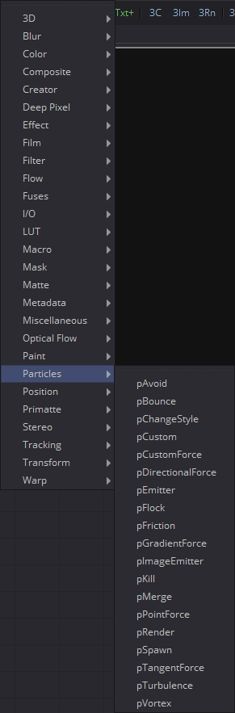</td>
    <td>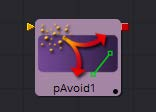</td>
    <td>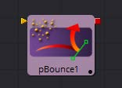</td>
    <td>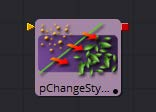</td>
  </tr>
  <tr>
    <td>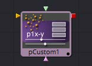</td>
    <td>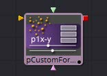</td>
    <td>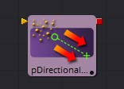</td>
  </tr>
  <tr>
    <td>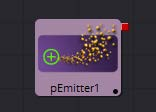</td>
    <td>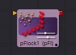</td>
    <td>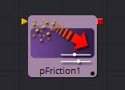</td>
  </tr>
  <tr>
    <td>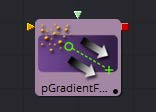</td>
    <td>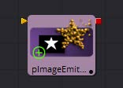</td>
    <td>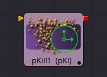</td>
  </tr>
  <tr>
    <td>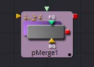</td>
    <td>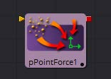</td>
    <td>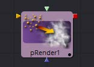</td>
  </tr>
  <tr>
    <td>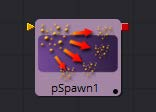</td>
    <td>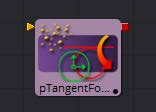</td>
    <td>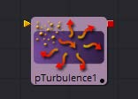</td>
  </tr>
  <tr>
    <td>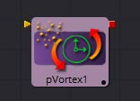</td>
  </tr>
</table>

