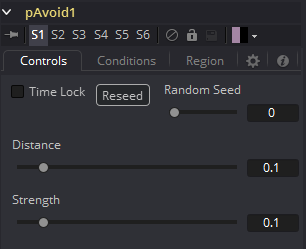
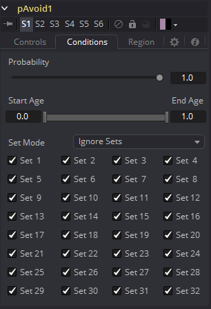
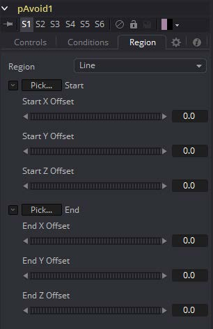

### pAvoid [pAv] 粒子回避

pAvoid工具用于在图像内创建一个区域或范围，受影响的粒子试图避免进入和/或穿过。

它有两个主要的控件，一个确定粒子开始远离该区域的距离，另一个确定粒子远离该区域的强度。

pAvoid工具创建了粒子远离指定区域的“意愿”。如果粒子速度强于pAvoid区域的距离与强度之和，粒子的“意愿”就不能克服它的动量，所以粒子还是会穿过该区域。

#### Controls 控件

##### Random Seed/Randomize 随机种子/随机化

随机种子用于设置应用于复制对象的抖动量的种子。两个具有相同设置但不同随机种子的复制工具将产生两个完全不同的结果。单击Randomize按钮来分配随机种子值。

##### Distance 距离

确定粒子远离该区域时粒子到区域的距离。

##### Strength 强度

确定粒子远离该区域时的强度。负值反而使粒子接近该区域。

#### Conditions Tab 条件选项卡

#### Region Tab 区域选项卡

请参阅本章的“Particle Common Controls 粒子通用控件”。

