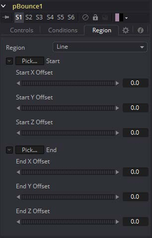

### pBounce [pBn] 粒子反弹

pBounce工具是用于创建一个区域，其中受影响的粒子接触到该区域会发生反弹。pBounce工具有三个主要的控件，如下所述。 

#### Controls 控件

##### Random Seed/Randomize 随机种子/随机化

随机种子用于设置应用于复制对象的抖动量的种子。两个具有相同设置但不同随机种子的复制工具将产生两个完全不同的结果。单击Randomize按钮来分配随机种子值。

##### Elasticity 弹性

Elasticity影响了反弹的强度，即反弹区域的粒子反弹后会留下多少速度。值为1.0将导致粒子反弹后拥有同样的速度。值为0.1将导致粒子被反弹后丢失90%的速度。

默认情况下，控件范围是0.0到1.0，更大的值可以通过手动输入。这将导致粒子发生碰撞后增加动量，而不是丢失它。负值不产生有用的结果。

##### Variance 变化量

默认情况下，打在反弹区域的粒子将会根据矢量和区域的角度被均匀的反弹回来。0.0往上增加将会产生反弹角度变化。这可以用来模拟一个粗糙表面效果。

##### Spin 自旋

默认情况下，粒子打在反弹区域后它们的角度和方向不会以任何方式受到影响。增加或减少Spin值将导致反弹区域的粒子基于碰撞角度来传递或改变现有的粒子自旋。正值向前自旋而负值向后自旋。该值越大，就越快应用到粒子的自旋。

##### Roughness 粗糙度

此滑块略微改变表面反弹随机粒子的方向。

##### Surface Motion 表面运动

此滑块会产生表面在运动一样的反弹行为，从而影响粒子。

##### Surface Motion Direction 表面运动方向

此指轮控件设置表面反弹的相对角度。

#### Conditions Tabs 条件选项卡

#### Region Tab 区域选项卡

请参阅本章的“Particle Common Controls 粒子通用控件”。