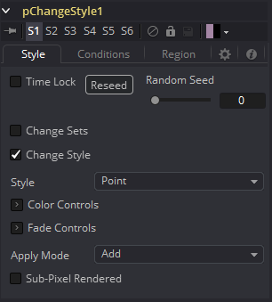
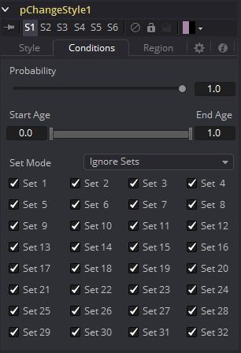
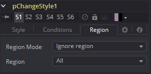

### pChangeStyle [pCS] 粒子改变样式

pChangeStyle工具提供了一种改变与定义区域相互作用的粒子外观和样式的机制。此工具主要控件完全是pEmitter工具的样式标签中找到的镜像。相交或进入该工具自定义区域的粒子会如描述发生改变。

除pCustom外，这是唯一能够修改粒子外观而不是运动的工具。它经常被用来在某些事件中使粒子外观发生改变，例如撞击屏障。

当以这种方法使用pChangeStyle时，它会自然地假定工具应该放置在发生事件的工具之后。举个例子，考虑创建一个粒子系统，其中pBounce使用一个线区域来反弹，之后会改变其样式。在该情况下，pChangeStyle工具也会使用一个线区域，放置在pBounce对应的位置。在流程中将pBounce放置在pChangeStyle之前会导致粒子在没来得及计算粒子效果时就被区域反弹了。结果就是粒子不再与pChangeStyle工具的区域相交，因此样式永远不会改变。

通常，要创建由流程中另一修改器工具创建的物理事件导致的样式上更改，必须将pChangeStyle工具放置在该工具之前，以使效果正常工作。

#### Style Tab 样式选项卡

##### Random Seed/Randomize 随机种子/随机化

随机种子用于设置应用于复制对象的抖动量的种子。两个具有相同设置但不同随机种子的复制工具将产生两个完全不同的结果。单击Randomize按钮来分配随机种子值。

##### Change Sets 改变集

此选项允许用户更改粒子的Set来使原始粒子受到其他力。请看在粒子一章的“Particle Common Controls  粒子通用控件”学习更多关于Sets的知识。

##### Style 样式

此选项允许改变粒子样式和外观。

请看在粒子一章的“Particle Styles  粒子样式”学习更多关于样式的知识。

#### Conditions Tabs 条件选项卡

#### Region Tab 区域选项卡

请参阅本章的“Particle Common Controls 粒子通用控件”。