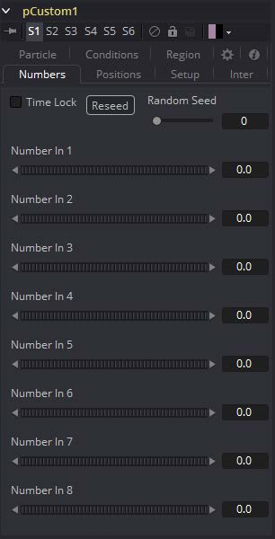

### pCustom [pCu] 粒子自定义

pCustom工具用于创建影响粒子特性的自定义表达式。此工具与Custom几乎相同，只是计算会影响粒子的属性，而不是像素的属性。

#### Numbers Tab 数值选项卡

#### Conditions and Regions Tab 条件与区域选项卡

请参阅本章的“Particle Common Controls 粒子通用控件”。

##### 下列粒子属性会出现在pCustom控件中：

| 属性                            | 描述                                         |
| ------------------------------- | -------------------------------------------- |
| px, py, pz                      | x、y和z轴上的粒子位置                        |
| vx, vy, vz                      | x、y和z轴上的粒子速度                        |
| rx, ry, rz                      | x、y和z轴上的粒子旋转                        |
| sx, sy, sz                      | x、y和z轴上的粒子自转                        |
| pxi1, pyi1                      | 粒子的2D位置，根据图像1的方向进行校正        |
| pxi2, pyi2                      | 粒子的2D位置，根据图像2的方向进行校正        |
| mass                            | 目前未被任何东西使用                         |
| size                            | 粒子的当前大小                               |
| id                              | 粒子的id                                     |
| r, g, b, a                      | 粒子的红色、绿色、蓝色和Alpha颜色值          |
| rgnhit                          | 如果粒子击中pCustom工具定义的区域，则该值为1 |
| rgndist                         | 此变量包含粒子与区域的距离                   |
| condscale                       | 粒子所在区域的强度                           |
| rgnix, rgniy, rgniz             | 此数值表示粒子击中区域上的位置               |
| rgnnx, rgnny, rgnnz             | 粒子撞击区域时的区域表面法线                 |
| w1, h1                          | 图像1的宽度和高度                            |
| w2 h2                           | 图像2的宽度和高度                            |
| i1, i2, i3, i4                  | 中间计算的结果1到4                           |
| s1, s2, s3, s4                  | 设置计算的结果1到4                           |
| n1..n8                          | 数字输入1到8的值                             |
| p1x, p1y, p1z .. p4x, p4y,  p4z | 位置输入1到4的值                             |
| time                            | 合成的当前时间或帧                           |
| age                             | 粒子的当前年龄                               |
| lifespan                        | 当前粒子的寿命                               |

有关自定义工具类的其他信息可以在Custom工具的文档中找到。 

该工具描述的所有运算符、函数和条件语句也适用于pCustom，包括两个图像输入的像素读取函数（例如`getr1w(x, y)`、`getz2b(x, y)`等）。