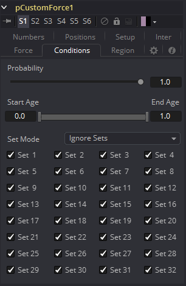
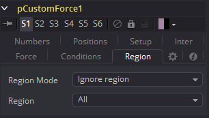
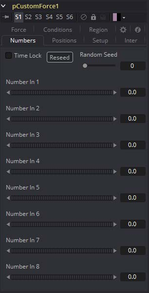
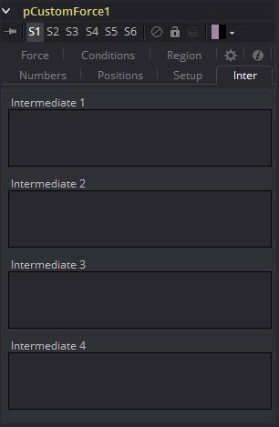
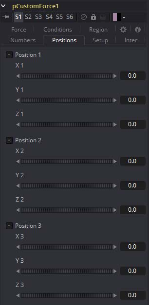
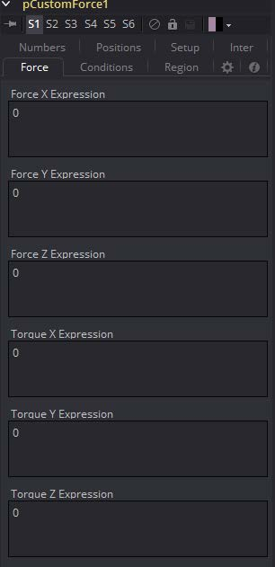

### pCustomForce [pCF] 粒子自定义力

该工具会施加一个单向力，该力会沿指定方向拉动受影响的粒子。它的主要控制因素会影响力的强度，并且力的角度会沿X，Y和Z轴拉动。 

由于此工具最常见的用途是模拟重力，因此默认的拉动方向沿Y轴向下（-90度），默认行为是忽略区域并影响所有粒子。

#### Conditions Tabs 条件选项卡

#### Region Tab 区域选项卡

请参阅本章的“Particle Common Controls 粒子通用控件”。

#### Setup Tab 设定选项卡

#### Numbers Tab 数值选项卡

#### Inter Tab 中间选项卡

#### Positions Tab 位置选项卡

#### Force Tab 力选项卡

