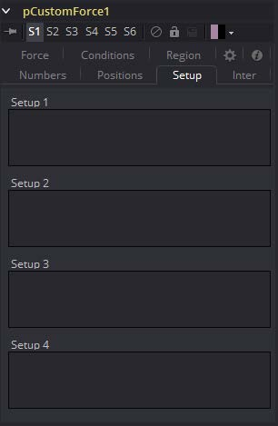

### pCustomForce [pCF] 粒子自定义力

pCustomForce允许你更改应用至粒子系统或子集的力。该工具很可能是Fusion中最复杂且最强大的工具。任何有一定脚本或C++编程经验的人都会发现pCustomForce使用的结构和术语非常熟悉。

#### Conditions Tabs 条件选项卡

#### Region Tab 区域选项卡

请参阅本章的“Particle Common Controls 粒子通用控件”。

#### Setup Tab 设定选项卡

#### Numbers Tab 数值选项卡

#### Inter Tab 中间选项卡

#### Positions Tab 位置选项卡

#### Force Tab 力选项卡

