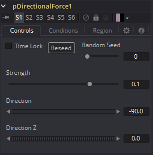
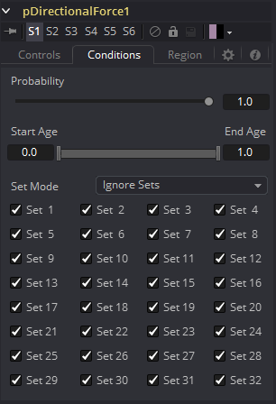
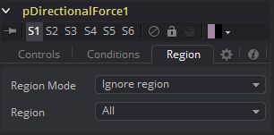

### pDirectionalForce [pDF] 粒子方向力

该工具会施加一个单向力，该力会沿指定方向拉动受影响的粒子。它的主要控件会影响力的强度以及沿X、Y和Z轴拉动力的角度。 

由于该工具最常见的用途是模拟重力，因此默认的拉动方向沿Y轴向下（-90度），默认行为是忽略区域并影响所有粒子。

#### Controls Tab 控件选项卡

##### Random Seed/Randomize 随机种子/随机化

随机种子用于设置应用于复制对象的抖动量的种子。两个具有相同设置但不同随机种子的复制工具将产生两个完全不同的结果。单击Randomize按钮来分配随机种子值。

##### Strength 强度

确定力的强度。正值将沿控件设置的方向移动粒子，负值将沿相反方向移动粒子。

##### Direction 方向

确定X/Y空间中的方向。

##### Direction Z Z轴方向

确定Z轴空间中的方向。

#### Conditions Tab 条件选项卡

#### Region Tab 区域选项卡

请参阅本章的“Particle Common Controls 粒子通用控件”。