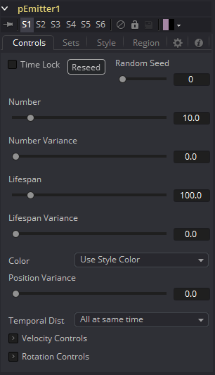
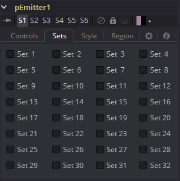
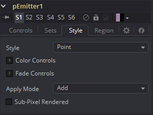
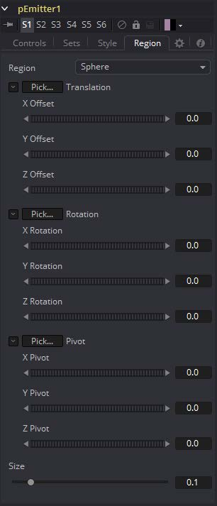

### pEmitter [pEm] 粒子发射器

pEmitter工具是粒子的主要来源  (pImageEmitter 是另一个)  ，通常是任意一套新的粒子系统中将使用的第一个工具。该工具包含了用于设置粒子的初始位置、方向和运动的控件，以及用于每个粒子视觉样式的控件。

与其他所有的粒子工具（pRender工具除外）一样，pEmitter会生成粒子集，而不是可见图像，因此无法在查看器上直接查看。要查看粒子系统的输出，请在pEmitter之后添加pRender工具。

#### Controls 控件

该选项卡包含影响节点发射粒子物理特性的设置。这些设置不会直接影响粒子的外观。相反它们会修改诸如速度、自旋、数量和寿命等行为。

##### Random Seed/Randomize 随机种子/随机化

随机种子用于设置应用于复制对象的抖动量的种子。两个具有相同设置但不同随机种子的复制工具将产生两个完全不同的结果。单击Randomize按钮来分配随机种子值。

##### Number 数量

此控件用于设置在每个帧上生成新的粒子数量。值为1将导致每一帧生成一个新的粒子。到第10帧时，将总共存在10个粒子（除非粒子的Lifespan设置小于10）。

设置此参数的动画来指定总共生成的粒子数。例如，如果总共只需要25个粒子，则对控件添加动画在第0-4帧上生成五个粒子，然后在第5帧上设置关键帧来为项目的其余部分生成零个粒子。

##### Number Variance 数量变化

该控件修改Number控件指定的每帧生成的粒子数量。例如，将Number设置为10.0并将Number Variance设置为2.0，则发射器每帧将生成9-11个粒子。如果Number Variance的值是Number值的两倍以上，则对于给定的帧，可能不会生成任何粒子。

##### Lifespan 寿命

该控件确定粒子消失或“死亡”之前将存在多长的时间。该控件的默认值为100帧，但可以将其设置为任意值。许多其他粒子控件的时间是相对于粒子的Lifespan的。例如，可以使用pEmitter的Style选项卡的Size Over Life图将粒子的大小设置为在其生命的最后80％内增加。

##### Lifespan Variance 寿命变化

与Number Variance一样，Lifespan Variance控件允许修改粒子生成的寿命。如果将Lifespan设置为100帧，并将Lifespan Variance设置为20帧，则发射器生成的粒子寿命将为90-110帧。

##### Color Source 颜色来源

这提供了指定每个粒子的颜色从何派生的能力。默认设置为Use Style Color（使用样式颜色），将根据pEmitter工具的Style选项卡中的设置提供每个粒子的颜色。

另一种设置是Use From Region（使用区域中的颜色），会覆盖Style选项卡标签中的颜色设置，并使用下层的位图区域的颜色。

Use Color From Region（使用来自区域的颜色）选项仅在pEmitter区域设置为使用合成中其他工具生成的位图时才有意义。当选择Use Color From Region（使用来自区域的颜色）选项时，在位图区域以外的区域中生成的粒子将渲染为白色。

##### Position Variance 位置变化

该控件确定粒子是否可以“出生”在pEmitter区域的边界之外。默认情况下，该值设置为零，这会将新粒子的创建区域限制为已定义区域的确切边界。将该控件的值增加到0.0以上将使粒子稍微出生在该区域的边界之外。值越高，该区域的边缘将变得“越柔”。

##### Velocity and Velocity Variance 速度和速度变化

这些控件确定了新粒子的初始速度。默认情况下，粒子没有速度，除非受到外力的作用，否则不会从原点离开。速度设置为10.0会导致粒子一步跨越图像的整个宽度，而速度1.0会使粒子经过10帧来跨越图像的宽度。

Velocity Variance修改出生时每个粒子的速度，与上面Lifespan Variance和Number Variance中所描述的方式相同。

##### Angle and Angle Variance 角度和角度变化

这确定了施加了速度的粒子在其出生时朝向的角度。

##### Angle Z and Angle Z Variance Z轴角度和Z轴角度变化

如上所述，但此控件确定粒子沿Z轴空间（朝向或远离相机）的角度。

##### Rotation Mode 旋转模式

该菜单控件提供了两个选项来帮助确定所发射粒子的方向。当粒子是球形时，该控件的效果将不明显。

- **Absolute Rotation 绝对旋转：**粒子将按照Rotation控件指定的方向进行定向，而与速度和方向无关。
- **Rotation Relative To Motion 相对于运动的旋转：**粒子的方向与粒子移动的方向相同。Rotation控制现在可以用于将粒子的方向旋转到远离其方向。

##### Rotation XYZ and Rotation XYZ Variance 旋转XYZ和旋转XYZ变化

这些控件允许单个粒子旋转。当处理位图粒子类型时，这可能特别有用，因为传入的位图可能没有朝向所需的方向。

Rotation XYZ Variance可用于围绕旋转XYZ值的中心随机地改变指定数量的旋转，以避免每个粒子都朝向完全相同的方向。

##### Spin XYZ and Spin Variance 自旋XYZ和自旋变化

这些提供了自旋，可以在出生时应用于每个粒子。粒子将每一帧旋转“x”度，这取决于Spin XYZ的值。 

Spin XYZ Variance将以上面描述的Number Variance和Lifespan Variance的方式改变应用于每个帧的自旋量。

#### Sets Tab 集选项卡

该选项卡包含影响工具发射的粒子物理特性的设置。这些设置不会直接影响粒子的外观。相反它们会改变诸如速度、自旋、数量和寿命等行为。集合还可用于通过更下游的其他粒子工具仅影响特定粒子。

#### Style Tab 样式选项卡

#### Region Tab 区域选项卡

