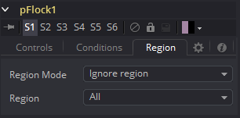

### pFlock [pFl] 粒子集群

群集是一种机制，可以用来模拟有机系统的行为，例如鸟群或蚂蚁群。它的使用可以使原本毫无生机的粒子系统看起来很活跃，或者在智能的指导下起作用。

pFlock工具通过两个基本原理工作。每个粒子都试图保持靠近其他粒子，并且每个粒子都试图保持与其他粒子的最小距离。这些被吸引的力量产生了看似有机的行为。

#### Controls 控件

##### Random Seed/Randomize 随机种子/随机化

随机种子用于设置应用于复制对象的抖动量的种子。两个具有相同设置但不同随机种子的复制工具将产生两个完全不同的结果。单击Randomize按钮来分配随机种子值。

##### Flock Number 群集数量

此控制的值表示受影响的粒子将尝试跟随其他粒子的数量。该值越高，粒子系统中出现的“团块”越明显，并且粒子组越大。

##### Follow Strength 跟随强度

该值表示每个粒子跟随其他粒子所期望的强度。较高的值将导致粒子似乎花费更多的力量和精力追随其他粒子。较低的值会增加指定粒子脱离粒子组的可能性。

##### Attract Strength 吸引强度

该值表示粒子之间的吸引力强度。当某个粒子与其他粒子的移动距离超过pFlock工具中定义的最大空间时，它将尝试靠近其他粒子。较高的值会使粒子充分保持其间距，从而更快地解决间距冲突。

##### Repel Strength 排斥强度

该值表示应用于粒子的力，这些粒子之间的距离比pFlock工具中定义的最小空间控制的距离更近。较高的值将导致粒子更快地远离相邻的粒子，从粒子群中射出。

##### Minimum/Maximum Space 最小/最大空间

此范围控制表示每个粒子自身尝试保持与其他粒子之间的距离。粒子将尝试不靠近或不超过此范围控制的“最小/最大值”所定义的空间。较小的范围将使运动更有条理性。较大的范围将被视为杂乱无章的。

#### Conditions Tab 条件选项卡

#### Region Tab 区域选项卡

请参阅本章的“Particle Common Controls 粒子通用控件”。

