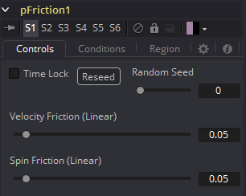
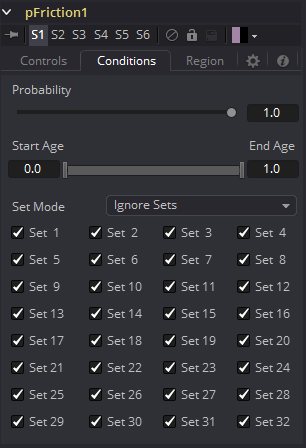
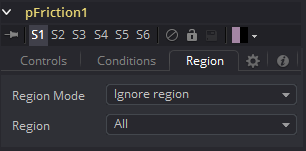

### pFriction [pFr] 粒子摩擦力

pFriction工具将阻力应用于粒子的运动，从而减慢粒子在定义区域内的运动。该工具可以产生两种类型的摩擦。一种类型降低与定义区域相交/交叉的任意粒子的速度，而另一种类型是降低或消除自旋和旋转。

#### Controls 控件

##### Random Seed/Randomize 随机种子/随机化

随机种子用于设置应用于复制对象的抖动量的种子。两个具有相同设置但不同随机种子的复制工具将产生两个完全不同的结果。单击Randomize按钮来分配随机种子值。

##### Velocity Friction (Linear) 速度摩擦力（线性）

该值表示施加到粒子速度的摩擦力。值越大，摩擦力越大，从而减慢粒子的速度。

##### Spin Friction (Linear) 自旋摩擦力（线性）

该值表示施加到粒子旋转或自旋的摩擦力。值越大，摩擦力越大，从而减慢粒子的旋转。

#### Conditions Tab 条件选项卡

#### Region Tab 区域选项卡

请参阅本章的“Particle Common Controls 粒子通用控件”。