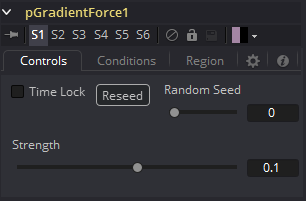
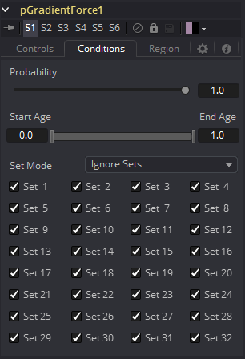
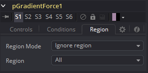

### pGradientForce [pGF] 粒子渐变力

渐变力控制接受两个输入，一个来自粒子系统，一个来自位图图像。粒子受到输入图像的alpha值中的梯度所产生的力的影响。粒子将沿着渐变加速，从白色移动到黑色（从高值到低值）。

该工具可用于使粒子具有向下移动或按照所提供形状轮廓的外观。

#### Controls 控件

##### Random Seed/Randomize 随机种子/随机化

随机种子用于设置应用于复制对象的抖动量的种子。两个具有相同设置但不同随机种子的复制工具将产生两个完全不同的结果。单击Randomize按钮来分配随机种子值。

##### Strength 强度

渐变力只有一个特定的控制，它会影响施加到粒子上的力的强度和加速度。此控制上的负值将导致从黑色到白色（从低值到高值）应用渐变力。

#### Conditions Tab 条件选项卡

#### Region Tab 区域选项卡

请参阅本章的“Particle Common Controls 粒子通用控件”。