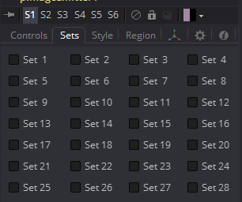
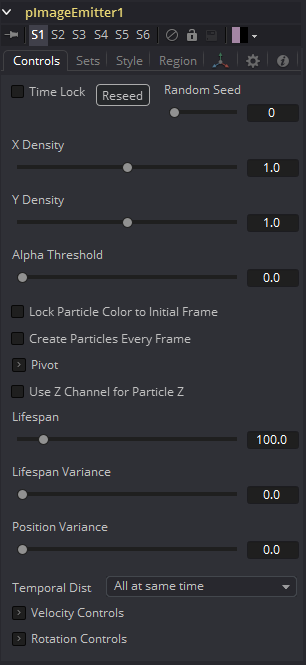
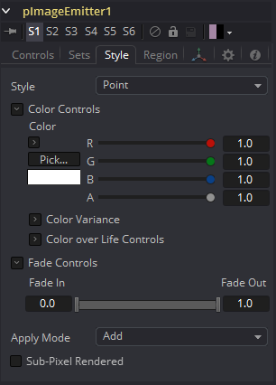
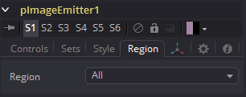
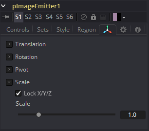

### pImageEmitter [pIE] 粒子图像发射器

pImageEmitter工具获取某个输入图像，并将图像的每个像素视为粒子。pImageEmitter与普通pEmitter之间的主要区别在于，该工具不会在指定区域内随机发射粒子，而是在基于输入图像的颜色以规则的2D网格发射像素。

#### Controls 控件

该工具中的绝大多数控制与pEmitter中的控制相同，这些控制在本文档都进行了记录。以下是pImageEmitter工具特有的控制说明。

##### X and Y Density X和Y密度

X和Y密度滑块用于将粒子映射到每个轴向的像素。它们控制采样网格的密度。任一滑块的值1.0表示每个像素1个采样。较小的值将产生更宽松、更明显的粒子分布，而大于1.0的值将在图像中的每个像素上创建多个粒子。

##### Alpha Threshold Alpha阈值

Alpha阈值用于限制粒子的生成，因此具有半透明alpha值的像素将不会产生粒子。这可用于锐化本来较柔化的Alpha通道边缘。阈值越高，像素在生成粒子之前必须越不透明。请注意，默认阈值0.0将为每个像素创建粒子，而不考虑Alpha，尽管许多像素可能是透明且不可见的。

##### Lock Particle Color to Initial Frame 将粒子颜色锁定到初始帧

选中此复选框可强制粒子在粒子的整个生命周期中保持其出生时的颜色。如果禁用此选项，并且输入图像在连续帧上更改，则粒子也将更改颜色以匹配图像。这允许在粒子网格上播放视频。

##### Create Particles Every Frame 每帧创建粒子

启用此功能后，每帧将创建一组全新的粒子，而不是仅在单帧上创建一组粒子。这可能会导致非常大的粒子系统，但会产生一些有趣的效果，例如，如果粒子被赋予了某种初始速度，或者是从动画源发出的。尝试使用较小的速度（角度Z为-90）并与一个沸腾的Fast Noise作为源素材,  以获取可飞过的平稳变化的粒子云。请注意，如果不选中此复选框，则只会创建一组粒子，因此设置发射器的任意其他控制的动画都将无效。

##### X/Y/Z Pivot X/Y/Z轴

这些控制允许您放置发射粒子的网格。

##### Use Z Channel for Particle Z 将Z通道用于粒子Z

如果用于生成粒子的输入图像具有Z深度通道，则该通道可用于确定粒子在Z空间中的初始位置。当与pRender工具中的相机旋转结合使用时，这可能会产生有趣的中空效果。

#### Sets Tab 集合选项卡

#### Style Tab 样式选项卡

#### Region Tab 区域选项卡

请参阅本章的“Particle Common Controls 粒子通用控件”。

#### Transform Tab 变换选项卡

> **注意：**除非将Alpha阈值提高到0.0以上，否则具有黑色（透明）Alpha通道的像素仍将生成不可见的粒子。这会大大降低渲染速度。
>
> `1/255 = 0.004`的Alpha阈值可以消除所有完全透明的像素。
>
> 像素在XY平面上以固定尺寸的2D网格发射，并以Pivot位置为中心。将“区域”从默认的“全部”更改为“允许将粒子创建”限制为更有限的区域。如果需要更改此网格的大小，请在pRender之后使用Transform 3D工具。
>
> 请记住，各种发射器控制仅在发射粒子时才应用。也就是说，它们设置了粒子的初始状态，并且在粒子的整个生命周期中都不会对其产生影响。由于pImageEmitter（默认情况下）仅在第一帧上发射粒子，因此对这些控制进行动画处理将无效。但是，如果启用了“每帧创建粒子”复选框，则将在每一帧发射新粒子，并将使用该帧的指定初始设置。