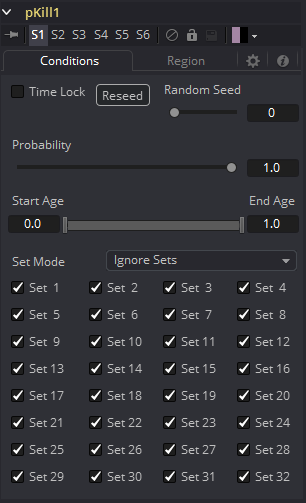
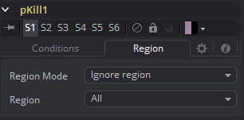

### pKill [pK] 粒子死亡

pKill工具用于销毁（杀死）任何与其区域交叉或相交的粒子。它没有特定的控件，因为它对粒子只有这种影响。在Region选项卡中找到的控件通常用于限制此工具，方法是将效果限制在特定区域、年龄、集合内，或者降低工具应用于指定粒子的概率。

#### Conditions Tab 条件选项卡

#### Region Tab 区域选项卡

请参阅本章的“Particle Common Controls 粒子通用控件”。