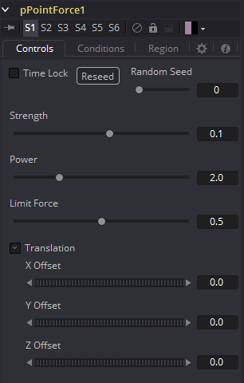
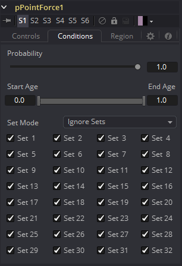
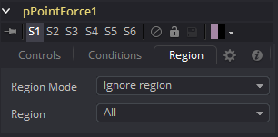

### pPointForce [pPF] 粒子点力

该工具会从3D空间中的单个点向各个粒子施加力。pPointForce可以在其影响范围内吸引或排斥粒子。pPointForce工具共有四个控件。

#### Controls 控件

##### Random Seed/Randomize 随机种子/随机化

随机种子用于设置应用于复制对象的抖动量的种子。两个具有相同设置但不同随机种子的复制工具将产生两个完全不同的结果。单击Randomize按钮来分配随机种子值。

##### Strength 强度

该参数设置工具发射的力的强度。正值代表吸引力。负值表示排斥力。

##### Power 力度

这确定了力的强度随距离衰减程度。值为零将不会导致强度下降。较高的值将使力的强度随着距离的增加而急剧下降。

##### Limit Force 限制力

Limit Force控件用于通过时间二次采样抵消潜在的问题。由于粒子的位置仅在单帧中被采样一次（除非在pRender工具中增加了二次采样），所以粒子可能会超出点力的位置并最终以相反的方向被射出。增加此控件的值可减少发生这种情况的概率。

##### X, Y, Z Center Position X、Y、Z中心位置

这些控件用于表示3D空间中的点力的X、Y和Z坐标。

#### Conditions Tab 条件选项卡

#### Region Tab 区域选项卡

请参阅本章的“Particle Common Controls 粒子通用控件”。