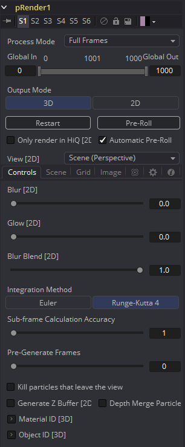
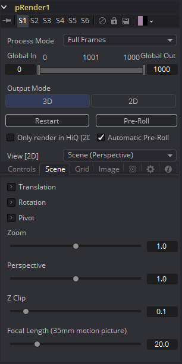
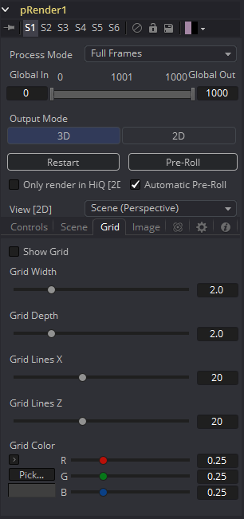
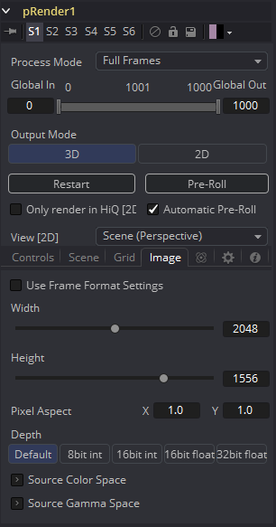

### pRender [pRn] 粒子渲染

pRender工具将粒子系统转换为图像或几何图形。默认情况下转换为3D粒子系统，并必须将其连接到Renderer 3D才能生成图像。这允许粒子在渲染之前与3D场景中的其他元素整合。

#### Controls 控件

##### Output Mode (2D/3D) 输出模式（2D/3D）

尽管pRender默认为3D输出，但也可以像DF4一样直接渲染2D图像。可以通过Output Mode控件上的3D和2D按钮来完成切换。如果pRender未连接到3D或2D的工具,  则还可以通过从显示视图的上下文菜单中选择*View > 2D Viewer*来进行切换。

在3D模式下，pRender工具中唯一有作用的控件是Restart、Pre-Roll和Automatic Pre-Roll、Sub-Frame Calculation Accuracy和pre-Generate Frames。其余控件只会影响2D粒子渲染。pRender工具在流程上还具有Camera输入，该摄像机允许连接Camera 3D工具。 可以在2D和3D模式下使用该控件，来控制渲染输出图像的视角。

##### Render and the Display Views 渲染和显示视图

在流程中选择了pRender工具后，与之相连的粒子工具的所有屏上控件都将显示在显示视图中。这提供了一个强制用于整体粒子系统的快速、易于修改的概览。

##### Pre-Roll Options 预卷选项

粒子工具通常需要先了解每个粒子在最后一帧上的位置，然后才能计算当前帧上施加到粒子上的力的影响。因此除单个帧间隔以外的任何时间手动更改当前时间都可能会产生不准确的图像。

该控件通过提供计算中间帧的方法来帮助解决这种情况。

##### Restart 重新启动

该控件也可以在3D模式下使用。单击Restart按钮将在当前帧处重新启动粒子系统，删除在该点之前创建的所有粒子，并在当前帧处从头开始启动粒子系统。

##### Pre-Roll 预卷

该控件也可以在3D模式下使用。单击此按钮将导致粒子系统从渲染范围的开始到当前帧重新计算。它不会渲染生成图像。它只会计算每个粒子的位置。这提供了一种相对较快的确保在视图中正确显示粒子位置的机制。

如果在选择Pre-Roll按钮时激活了pRender工具，则预卷的进度将显示在预览视图中，每个粒子仅显示为点的样式。

##### Automatic Pre-Roll 自动预卷

选中Automatic Pre-Roll复选框可使粒子系统在当前帧发生更改时自动将粒子预卷到当前帧。这可以避免在每次跳跃时间单帧时，都需要手动选择Pre-Roll按钮。在自动预卷过程中，粒子系统的进度不会显示在视图中，以防止分散视觉干扰。

#### About Pre-Roll 关于预卷

预卷是必要的，因为粒子系统的状态完全取决于粒子最后得知的位置。如果将当前时间更改为最后一帧粒子状态未知的帧，则粒子的显示将会在最后一个已知位置计算，从而产生不准确的结果。

方便说明，将pEmitter和pRender工具添加到合成中。在任意一个显示视图中查看pEmitter。右键单击显示视图，然后在上下文菜单中选择*Views > 2D Viewer*。

将粒子的Velocity设置为0.1。将pEmitter放在屏幕的左侧边缘，将当前帧设置为0，将渲染范围设置为0-100，然后点击播放按钮。观察粒子系统的行为。

停止播放并将当前时间返回到第0帧。确保在pRender工具中关闭了Automatic Pre-Roll选项。现在，尝试从第0帧跳到第10帧，然后跳到第60帧和第90帧。不要经过它们中间的帧。使用当前时间编辑控件或直接在时间尺中单击以直接跳到那帧。

查看粒子系统如何仅将其添加到已经创建的粒子中，而不尝试创建将要在中间帧中发射的粒子。尝试在Pre-Render工具中选择Pre-Roll按钮。现在的粒子系统状态已正确表示。

对于简单、快速渲染的粒子系统，建议启用Automatic Pre-Roll选项。而对于具有较长时间范围的较慢粒子系统，仅手动进行预卷可能才能达到需要的效果。

##### Only Render in Hi-Q 仅在Hi-Q中渲染

勾选此复选框将会取消选中Hi-Q复选框时导致粒子的样式被覆盖，从而仅生成快速渲染的点样式粒子。当处理大量的基于图像或Blob样式的慢速粒子时非常有用。要查看最终渲染中出现的粒子，只需勾选Hi-Q复选框即可。

##### View 视图

该下拉列表提供用来确定在3D粒子系统中摄像机视图位置的选项。默认选项Scene (Perspective)将从虚拟摄像机的透视图渲染粒子系统，该摄像机的位置可以使用Scene选项卡中的控件进行修改。其他选项提供粒子系统正面、顶部和侧面的正交视图。

注意，粒子工具的屏上控件的位置不受此控件的影响。在2D模式下，屏上控件始终在显示视图中显示为前正交视图。（3D模式始终可以正确获得控件的位置。）

如果将Camera 3D工具连接到流程中pRender工具的Camera输入或pRender处于3D模式，则View设置将被忽略。

#### Output Mode 输出模式

##### Blur, Glow and Blur Blend 模糊、发光和模糊混合度

这些滑块在渲染图像时应用Gaussian（高斯）模糊、发光和模糊混合进图像，使得柔化粒子来将它们混合在一起。最终结果与在流程中的pRender工具之后添加模糊节点一样。仅用于2D粒子。

##### Sub Frame Calculation Accuracy 子帧计算精度

这将决定计算粒子系统时在帧之间获取的子采样数量。较高的值将提高计算的准确性，但也会增加渲染粒子系统所花费的时间。

##### Pre-Generate Frames 预生成的帧数

该控件用于使粒子系统在其第一个有效帧之前预生成一定数量的帧。这用来为粒子系统提供其开始的初始状态。

一个很好的例子是，在一个镜头中，使用粒子来产生从烟囱冒出的烟雾。将“预生成的帧”设置为足够高的数字，以确保在渲染开始之前场景中已经存在烟雾，而不是在前几帧中使烟雾刚开始从发射器中出现。

##### Kill Particles that Leave the View 杀死离开视线的粒子

勾选此复选框控件将自动销毁离开图像可见边界的所有粒子。这可以帮助加快渲染时间。但以这种方式销毁的粒子将永远不会返回，即便受到外力作用。

##### Generate Z Buffer 生成Z缓冲区

勾选此复选框将使pRender工具在图像中生成Z缓冲区通道。每个粒子的深度在Z缓冲区中表示。然后，此通道可用于其他深度操作，例如Depth Blur、Depth Fog和下游的Z通道合并。

启用此选项可能会大幅增加粒子系统的渲染时间。

##### Depth Merge Particles 深度合并粒子

启用此选项将导致使用“深度合并”技术而非基于图层的技术将粒子合并在一起。

#### Scene Tab 场景选项卡

该选项卡中的所有控件都不会对3D粒子系统产生任何影响。它们仅适用于2D粒子系统。

该选项卡中的控件用于通过旋转、平移和轴转换在3D空间中重新定位虚拟相机。也可以对摄像机视图进行缩放和透视调整。默认值基本上与前正交视图相同。此处应用的变换不会影响用于粒子工具的屏上控件的绘制（下面描述的粒子网格除外）。处理2D粒子时，请使用前正交视图可精确显示屏幕上的控制。这些控件可以添加动画。 

##### Zoom

？

##### Perspective

？

##### Z Clip Z裁切

Z Clip控件用于在相机前面设置一个裁切平面。穿过该平面的粒子将被裁切，以防止它们撞击摄像机的虚拟镜头并影响场景。

##### Focal Length (35mm motion picture)

？

#### Grid Tab 网格选项卡

该选项卡中的所有控件都不会对3D粒子产生任何影响。

网格是一种有用的、不会渲染显示的、用于确定在3D空间中2D粒子的方向辅助线。网格在渲染中是看不到的，就像在渲染中看不到中心十字线一样。

可以使用该选项卡中的控件来设置宽度、深度、行数和网格颜色。这些控件不能添加动画。

#### Image Tab 图像选项卡

该工具的Image选项卡中的控件确定图像的宽度、高度和宽高比。有关使用这些控件的详细信息，请参阅Creator Common Controls页面。

##### Motion Blur 运动模糊

与Fusion中的其他2D工具一样，在Fusion选项卡中启用了Motion Blur。可以设置Quality（质量）、Shutter Angle（快门角度）、Sample Center（采样中心）和Bias（偏移），模糊将应用于所有移动的粒子。

> **注意：**3D模式的粒子（使用Renderer 3D渲染）上的运动模糊还要求将相同的运动模糊设置应用于Renderer 3D工具。