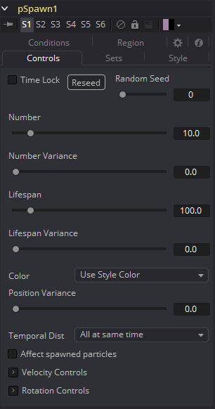
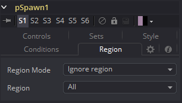

### pSpawn [pSp] 粒子繁殖

pSpawn工具使每个受影响的粒子充当发射器，可以产生自己的一个或多个粒子。原始粒子一直持续到其自身寿命结束，并且它发出的每个粒子都变得完全独立，并具有自己的寿命和属性。

只要粒子落在pSpawn工具的作用下，它就会继续生成粒子。重要的是，通过限制器（例如开始和结束年龄、概率、集合和区域）以及设置发射器参数的动画来限制工具的效果，以使工具仅在需要时才可操作。

#### Controls 控件

该pSpawn工具有大量的控制，其中大部分控制与pEmitter工具中的控制完全相同。有几个控制是pSpawn工具独有的，其作用如下所述。

##### Affect Spawned Particles 影响生成的粒子

选中此复选框会使生成创建的粒子也受到后续帧上的pSpawn工具的影响。这会成倍增加系统中粒子的数量，从而使渲染时间提高到不合理的程度。请谨慎使用此复选框。

##### Velocity Transfer 速度传递

此控制确定将源粒子的速度转移到其生成粒子的速度。默认值1.0导致每个新粒子采用其源粒子的速度和方向的100％。较低的值会将较少的原始运动传递给新粒子。

#### Region Tab 区域选项卡

请参阅本章的“Particle Common Controls 粒子通用控件”。