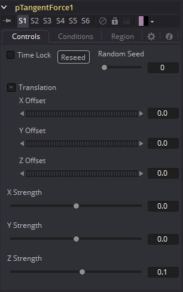
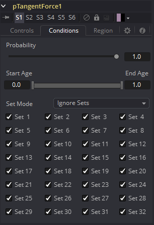
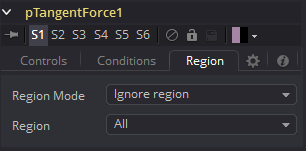

### pTangentForce [pTF] 粒子切向力

该工具用于对粒子施加切向力，该力垂直于pTangentForce区域与其影响的粒子之间的矢量。

该工具的控件用于在3D空间中定位偏移，并独立确定沿每个轴的切向力强度。

#### Controls 控件

##### Random Seed/Randomize 随机种子/随机化

随机种子用于设置应用于复制对象的抖动量的种子。两个具有相同设置但不同随机种子的复制工具将产生两个完全不同的结果。单击Randomize按钮来分配随机种子值。

##### X, Y, Z Center Position X、Y、Z中心位置

这些控件用于表示3D空间中切向的X、Y和Z坐标。

##### X, Y, Z Center Strength X、Y、Z中心强度

这些控件用于表示3D空间中切向力的强度。

#### Conditions Tab 条件选项卡

#### Region Tab 区域选项卡

