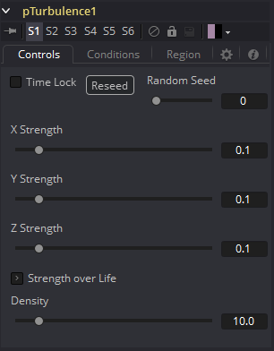
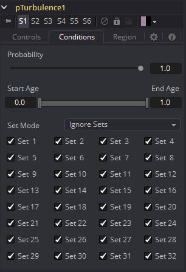
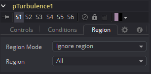

### pTurbulence [pTr] 粒子扰乱

pTurbulence工具根据每个粒子的位置上施加了基于频率的混乱，从而导致运动变得不可预测且不均匀。该工具的控件会影响每个轴上扰乱的强度和密度。

#### Controls 控件

##### Random Seed/Randomize 随机种子/随机化

随机种子用于设置应用于复制对象的抖动量的种子。两个具有相同设置但不同随机种子的复制工具将产生两个完全不同的结果。单击Randomize按钮来分配随机种子值。

##### X, Y and Z Strength X、Y和Z强度

强度控件会影响赋予粒子的混沌运动量。

##### Strength Over Life 强度生命周期

该LUT控件可用于根据粒子的年龄控制应用于粒子扰乱数量。例如，火焰粒子最初可能在其生命开始时几乎没有施加扰乱，并随着时间的流逝，扰乱会增加。

##### Density 密度

使用该控件可以调整扰乱的密度。较高的值将使得扰乱产生更好的变化。

#### Conditions Tab 条件选项卡

#### Region Tab 区域选项卡

请参阅本章的“Particle Common Controls 粒子通用控件”。