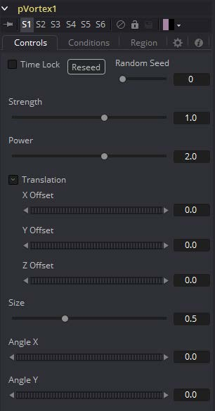
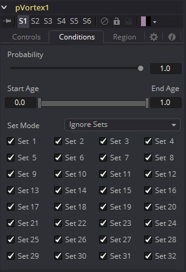
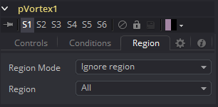

### pVortex [pVt] 粒子漩涡

pVortex工具向每个粒子施加旋转力，使它们被吸引到漩涡的源头。除了常见的粒子控件外，pVortex工具还具有以下控件。

#### Controls 控件

##### Random Seed/Randomize 随机种子/随机化

随机种子用于设置应用于复制对象的抖动量的种子。两个具有相同设置但不同随机种子的复制工具将产生两个完全不同的结果。单击Randomize按钮来分配随机种子值。

##### Strength 强度

该控件确定应用于每个粒子漩涡力的强度。

##### Power 功率

该控件确定漩涡力的强度随距离衰减的程度。

##### X, Y, and Z Offset X, Y和Z偏移

使用这些滑块设置漩涡偏移受影响粒子的数量。

##### Size 大小

用于设置漩涡力的大小。

##### Angle X and Y X和Y角度

这些滑块控制漩涡沿X和Y轴施加旋转力的大小。

#### Conditions Tab 条件选项卡

#### Region Tab 区域选项卡

请参阅本章的“Particle Common Controls 粒子通用控件”。

