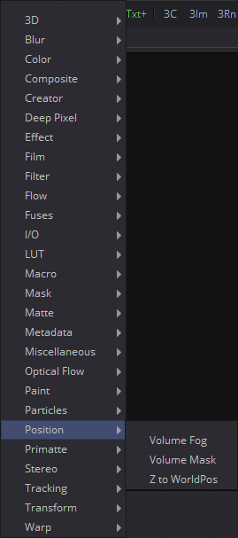
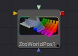

## 第二十五章 Position Tools 位置工具

- [Volume Fog [VlF] 体积雾](./Volume%20Fog%20[VlF].md) 
- [Volume Mask [VlM] 体积遮罩](./Volume%20Mask%20[VlM].md) 
- [Z To WorldPos [ZtW] Z至世界位置](./Z%20To%20WorldPos%20[ZtW].md) 
- [WPP Concept WPP概念](./WPP%20Concept.md)

<table id="img">
  <tr>
    <td rowspan="3"></td>
    <td></td>
  </tr>
  <tr>
    <td></td>
  </tr>
  <tr>
    <td></td>
  </tr>
</table>
